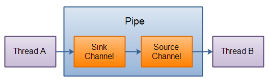

## Java NIO 学习笔记

[TOC]

> 原文链接：http://tutorials.jenkov.com/java-nio/index.html (有所修改)

### 一、前言

-------------------------------

Java NIO 从 JDK1.4 开始引入，其提供了与标准 IO 不同的 IO 工作方式：

- **Channels and Buffers**：通道和缓冲区，NIO 的数据总是从通道读取到缓冲区，或者从缓冲区写入到通道。
- **Asynchronous IO**：异步IO，Java NIO 可以异步使用IO。例如，当线程从通道中读取数据到缓存区时，线程还可以进行其他操作。
- **Selectors**：选择器，Java NIO 采用选择器循环遍历用于监听多个通道的事件。因此单个线程也可以监听多个数据通道。


### 二、Java NIO 组件

-------------------------

Java NIO 有三个重要组件：Channels、Buffers 和 Selectors。

#### 1、Channels 和 Buffers

Java NIO 的所有 IO 操作都是在 Channels 和 Buffers 之间进行的。


Java NIO 的 Channels 涵盖了 UDP、TCP、网络IO、文件IO 等(具体参考JAVA API文档)。

Java NIO 的 Buffers 覆盖的数据类型包括了 byte、short、int、long、float、double 和 char。


##### 1.1、Channnels(通道)

Java NIO  的 Channel 类似于流，但又有点不同：

- 可以在通道中进行双向读写，但流通常是单向的。
- 通道可以进行异步读写。
- 通道中的数据的读写目的地都是缓冲区。


##### 2.2、Buffers(缓冲区)

buffers 本质是一块专门用于读写的内存，这个数据块专门对外提供一系列方便读写开发的接口。利用 buffer 读写数据一般遵循以下四个操作：

- 写入数据到 Buffer
- 调用 flip() 方法
- 从 Buffer 中读取数据
- 调用 clear() 方法或者 compact() 方法

> clear() 方法会清空整个 buffer。
>
> compact() 方法则是清空已读取的数据。

Buffers 有三个重要属性：**capacity(容量)**、**position(位置)** 和 **limit(限制)**。

容量：buffer 有一个固定大小，也就是最多能写入容量的字节数。一旦buffer写满了就需要清空已读数据以便下次继续写入新的数据。

位置：写入数据到 buffer 中开始的位置，其默认初始化值为0；当从写模式转入到读模式时，position自动归零。

限制：在写模式中，就是我们所写入的最大数据量，等同于 buffer 的容量；切换到读模式时，就是我们所能读取的最大数据量。


#### 2、 Selectors

Selector 允许单线程处理多个 Channel。如果你的应用打开了多个连接(通道)，而且每个连接的IO带宽都不高的话，可以使用 Selectors 来增加资源利用，减小不要的开销。


> 为什么使用 Selector？
>
> 答：单个线程处理多个Channel。对于操作系统来说，线程之间上下文切换的开销很大，而且每个线程都要占用系统一部分资源(内存)。但是，现代操作系统和CPU在多任务方面表现越来越好，多线程的开销也并非是那么大。如果一个CPU有多个内核，不使用多任务其实就是在浪费CPU能力。

##### 2.1 Selectors

将一个Channel 注册到 Selector 中，

```java
        try {
            Selector selector = Selector.open();    // 创建 Selector
            SocketChannel channel = SocketChannel.open();   // 创建一个 TCP 网络读写通道
            // 将 channel 注册 Selector 中
            // Channel 必须是非阻塞的(所以不能是 FileChannel)
            SelectionKey key = channel.register(selector, SelectionKey.OP_READ);
          	// 逻辑处理
        } catch (IOException e) {
            e.printStackTrace();
        }
```

一个 Channel 触发了一个事件可以看做该事件处于就绪状态。因此当channel与server连接成功后，那么就是“连接就绪”状态。server channel接收请求连接时处于“可连接就绪”状态。channel有数据可读时处于“读就绪”状态。channel可以进行数据写入时处于“写就绪”状态。

有四种状态：

- `SelectionKey.OP_READ`——Read
- `SelectionKey.OP_ACCEPT`——Accept
- `SelectionKey.OP_WRITE`——Write
- `SelectionKey.OP_CONNECT`——Connect

##### 2.1 SelectionKey

通常将 Channel 注册到 Select 中会获得一个 SelectionKey 对象，该对象包含了一些比较有价值的属性：

- Interest Set

  Interest Set 是我们希望处理的事件的集合。他的值就是注册时传入的参数。一般情况下，我们使用这种发来判断 Selector 的状态：

  ```java
  int interestSet = selectionKey.interestOps();
  boolean isInterestedInAccept  = interestSet & SelectionKey.OP_ACCEPT;
  // 省略其他三种状态
  ```

  用 & 操作 interest Set 和给定的SelectionKey常量，可以确定某个确定的事件是否在interest 集合中。

- Ready Set

  Ready Set 是通道已经准备就绪的操作的集合，可以通过如下方法来使用：

  ```java
  int readySet = selectionKey.readyOps();
  boolean isAcceptable = selectionKey.isAcceptable();
  // 省略其他三种状态
  ```

- Channel + Selector

  操作 Channel 和 Selector 的方法：

  ```java
  Channel  channel  = selectionKey.channel();
  Selector selector = selectionKey.selector();
  ```

- Attaching Objects

  可以给一个SelectionKey附加一个Object，这样做一方面可以方便我们识别某个特定的channel，同时也增加了channel相关的附加信息。使用方法如下：

  ```java
  selectionKey.attach(theObject);
  Object attachedObj = selectionKey.attachment();
  ```

  附加对象的操作也可以在register的时候就执行：

  ```java
  SelectionKey key = channel.register(selector, SelectionKey.OP_READ, theObject);
  ```


#### 3、在选择器中调用通道

##### 3.1 通道就绪

一旦我们向Selector注册了一个或多个channel后，就可以调用select来获取channel。select方法会返回所有处于就绪状态的channel。select() 方法有三个重载方法。

```java
public abstract int select() throws IOException;
public abstract int select(long timeout) throws IOException;
public abstract int selectNow() throws IOException;
```

先说一下 select() 方法的解释：选择一些I/O操作已经准备好的channel。每个channel对应着一个key。这个方法是一个阻塞的选择操作。**当至少有一个通道被选择时才返回**。当这个方法被执行时，当前线程是允许被中断的。

select(long timeout) :该和select()一样，除了最长会阻塞timeout毫秒(参数)。 这个方法并不能提供精确时间的保证，和当执行wait(long timeout)方法时并不能保证会延时timeout道理一样。

>对于 timeout 的说明：
>
>- 如果 timeout为正，则select(long timeout)在等待有通道被选择时至多会阻塞timeout毫秒
>- 如果timeout为零，则永远阻塞直到有至少一个通道准备就绪。
>- timeout不能为负数

接下来是，selectNow() ：这个方法与select()的区别在于，是非阻塞的，即当前操作即使没有通道准备好也是立即返回。只是返回的是0。**值得注意的是：调用这个方法会清除所有之前执行了wakeup方法的作用。**


##### 3.2 通道遍历

在调用select并返回了有channel就绪之后，可以通过选中的key集合来获取channel，这个操作通过调用selectedKeys()方法。

当向Selector注册Channel时，Channel.register()方法会返回一个SelectionKey 对象。这个对象代表了注册到该Selector的通道。

```java
Set<SelectionKey> selectedKeys = selector.selectedKeys();
```

**注意**，一般每次迭代末尾会调用 keyIterator.remove()。Selector不会自己从已选择键集中移除SelectionKey实例。必须在处理完通道时自己移除。下次该通道变成就绪时，Selector会再次将其放入已选择键集中。


##### 3.3 一个简单的完整的示例

打开一个Selector，注册一个通道注册到这个Selector上(通道的初始化过程略去),然后持续监控这个Selector的四种事件（接受，连接，读，写）是否就绪。来源于[Java NIO Selector选择器](http://wiki.jikexueyuan.com/project/java-nio-zh/java-nio-selector.html)。

```java
Selector selector = Selector.open();
channel.configureBlocking(false);
SelectionKey key = channel.register(selector, SelectionKey.OP_READ);
while(true) {
    int readyChannels = selector.select();
    if(readyChannels == 0) continue;
  	Set selectedKeys = selector.selectedKeys();
  	Iterator keyIterator = selectedKeys.iterator();
  	while(keyIterator.hasNext()) {
    	SelectionKey key = keyIterator.next();
    	if(key.isAcceptable()) {
        	// a connection was accepted by a ServerSocketChannel.
    	} else if (key.isConnectable()) {
        	// a connection was established with a remote server.
    	} else if (key.isReadable()) {
        	// a channel is ready for reading
    	} else if (key.isWritable()) {
        	// a channel is ready for writing
    	}
    	keyIterator.remove();
  }
}
```


### 三、各种通道

-------------------------------------------------

#### 1、FileChannel文件通道

Java NIO中的FileChannel是用于连接文件的通道。通过文件通道可以读、写文件的数据。**注意，FileChannel不可以设置为非阻塞模式，它只能在阻塞模式下运行。**

- 打开 FileChannel

  我们无法直接打开一个FileChannel，需要通过使用一个InputStream、OutputStream或RandomAccessFile来获取一个FileChannel实例。下面是通过RandomAccessFile打开FileChannel的示例：

  ```java
  	
  RandomAccessFile aFile = new RandomAccessFile("data/data.txt", "rw");
  FileChannel inChannel = aFile.getChannel();
  ```

- 从 FileChannel 读取数据

  调用 read() 方法来读取数据

  ```java
  ByteBuffer buf = ByteBuffer.allocate(48);	// 先分配一个Buffer
  int bytesRead = inChannel.read(buf);		// 并将读取的数据写入到Buffer
  ```

- 向 FileChannel 写入数据

  调用 write() 方法可以向 FileChannel 中写入数据：

  ```java
  ByteBuffer buf = ByteBuffer.allocate(48);
  buf.clear();
  buf.put("String".getBytes());
  buf.flip();
  while(buf.hasRemaining()){	// 循环调用 write() 是因为无法保证一次性写入完毕
    	channel.write();		// 写入数据
  }
  ```

- 关闭 FileChannel

  ```java
  channel.close();
  ```

- 其他补充

  - Position：定位读写的位置。
  - truncate：可以截取指定长度的文件。
  - force：把所有未写磁盘的数据都强制写入磁盘。

  ​

#### 2、SocketChannel 套接字通道

创建 SocketChannel 的两个方法：

1. 打开一个SocketChannel并连接到互联网上的某台服务器。
2. 一个新连接到达ServerSocketChannel时，会创建一个SocketChannel。

**SocketChannel 的操作与 FileChannel 的操作非常类似，因此不在重复记录。**

- 非阻塞模式：SocketChannel 可以设置为非阻塞模式(non-blocking mode)，这样子就可以进行异步操作了。
- 几个重要方法：
  -  write()：非阻塞模式下，write()方法在尚未写出任何内容时可能就返回了。所以需要在循环中调用write()。
  -  read()：非阻塞模式下,read()方法在尚未读取到任何数据时可能就返回了。所以需要关注它的int返回值，它会告诉你读取了多少字节。


#### 3、ServerSocketChannel 服务端套接字通道

Java NIO中的 ServerSocketChannel 是一个可以监听新进来的TCP连接的通道, 就像标准IO中的ServerSocket一样。

```java
ServerSocketChannel serverSocketChannel = ServerSocketChannel.open();	// 开启一个服务器通道
serverSocketChannel.socket().bind(new InetSocketAddress(9999));			// 绑定9999端口
while(true){	// 监听链接
  	SocketChannel channel = serverSocketChannel.aaccept();
  	// 逻辑处理
}
serverSocketChannel.close();		// 关闭通道
```

注意：ServerSocketChannel可以设置成非阻塞模式。在非阻塞模式下，accept() 方法会立刻返回，如果还没有新进来的连接,返回的将是null。 因此，需要检查返回的SocketChannel是否是null。


#### 4、DatagramChannel 数据报通道

Java NIO中的DatagramChannel是一个能收发UDP包的通道。因为UDP是无连接的网络协议，所以不能像其它通道那样读取和写入。它发送和接收的是数据包。

```java
DatagramChannel channel = DatagramChannel.open();
channel.socket().bind(new InetSocketAddress(9999));// 绑定9999端口，收发UDP包
// 接收数据
ByteBuffer buf = ByteBuffer.allocate(48);
buf.clear();
channel.receive(buf);
// 发送数据
ByteBuffer buffer = ByteBuffer.allocate(48);
buffer.clear();
buffer.put("Data".getBytes());
buffer.flip();
int byteSent = channel.send(buf, new InetSocketAddress("baidu.com", 80));
// 注意：UDP本身不保证任何数据的发送接收问题

/**
 * 或者连接后，调用 read() 和 write() 方法
 */
// int bytesRead = channel.read(buf);
// int bytesWrite = channel.write(buf);
```


#### 5、Pipe 管道

Pipe 管道是两个线程间单向传输数据的连接。一个管道(Pipe)有一个source channel和一个sink channel。我们把数据写到sink channel中，这些数据可以通过source channel再读取出来。



```java
// 创建管道
Pipe pipe  = Pipe.open();
// 写入数据
Pipe.SinkChannel sinkChannel = pipe.sink();	// 访问 SinkChannel
ByteBuffer buf = ByteBuffer.allocate(48);
buf.clear();
buf.put("Data".getBytes());
buf.flip();
while(buf.hasRemaining()) {
	sinkChannel.write(buf);
}
// 读取数据
Pipe.SourceChannel sourceChannel = pipe.source();
int bytesRead = sourceChannel.read(buf);
```


### 四、Java NIO vs IO

-----------------------------------

#### 1、 阻塞IO通信模型

阻塞IO在调用结束返回之前，当前IO线程都会被挂起，而调用线程只有在得到结果之后才会返回。例如，调用ServerSocket.accept()方法，会一直堵塞到有客户端连接才会返回。阻塞IO的通信模型示意图如下：


阻塞IO存在着一些缺点：

1. 可能会导致创建了大量线程，每个线程都会占用一定资源空间；
2. 阻塞可能带来频繁的线程切换，而线程切换对于资源的消耗也是很大的。


#### 2、NIO 通信模型

NIO 的工作原理：

- 由一个线程来处理所有的IO事件，并负责分发；
- 当IO事件到达时，自动触发，而不是同步监听事件；
- 线程之间通过 wait,notify 等方式通讯。


#### 3、NIO 和 IO 的主要区别

| IO              | NIO             |
| --------------- | --------------- |
| Stream oriented | Buffer oriented |
| Blocking IO     | No blocking IO  |
|                 | Selectors       |

##### （1）面向流 vs 面向缓冲区

- Java IO面向流意思是我们每次从流当中读取一个或多个字节。怎么处理读取到的字节是我们自己的事情。他们不会再任何地方缓存。再有就是我们不能在流数据中向前后移动。如果需要向前后移动读取位置，那么我们需要首先为它创建一个缓存区。
- Java NIO是面向缓冲区的，这有些细微差异。数据是被读取到缓存当中以便后续加工。我们可以在缓存中向向后移动。这个特性给我们处理数据提供了更大的弹性空间。当然我们任然需要在使用数据前检查缓存中是否包含我们需要的所有数据。另外需要确保在往缓存中写入数据时避免覆盖了已经写入但是还未被处理的数据。 

##### （2）阻塞 IO vs 非阻塞 IO

- Java IO的各种流都是阻塞的。所以在对 IO 进行操作时，线程都会被堵塞直到操作结束，在此期间线程不能做其他如何事件。
- Java NIO的非阻塞模式使得线程可以通过channel来读数据，并且是返回当前已有的数据，或者什么都不返回如果当前没有数据可读的话。这样一来线程不会被阻塞住，它可以继续向下执行。

##### （3）Selectors

- Java NIO的selector允许一个单一线程监听多个channel输入。我们可以注册多个channel到selector上，然后然后用一个线程来挑出一个处于可读或者可写状态的channel。selector机制使得单线程管理过个channel变得容易。


#### 4、小结

NIO允许我们只用一条线程来管理多个通道（网络连接或文件），随之而来的代价是解析数据相对于阻塞流来说可能会变得更加的复杂。

- 如果需要同时管理成千上万的链接，这些链接只发送少量数据，用单线程来管理这些链接也是有优势的。
- 如果链接不是很多，但每个链接占用较大带宽、每次都要发送大量数据，那么使用传统的 IO 可能是比较好的选择。


### 五、参考地址

-----------------------------------------------------

- [Java NIO(一份非常好的资料分享，虽然是英文版)](http://tutorials.jenkov.com/java-nio/overview.html)
- [《Java源码解析》之NIO的Selector机制](http://blog.csdn.net/u010853261/article/details/53488879)
- [怎样理解阻塞非阻塞与同步异步的区别?](https://www.zhihu.com/question/19732473)