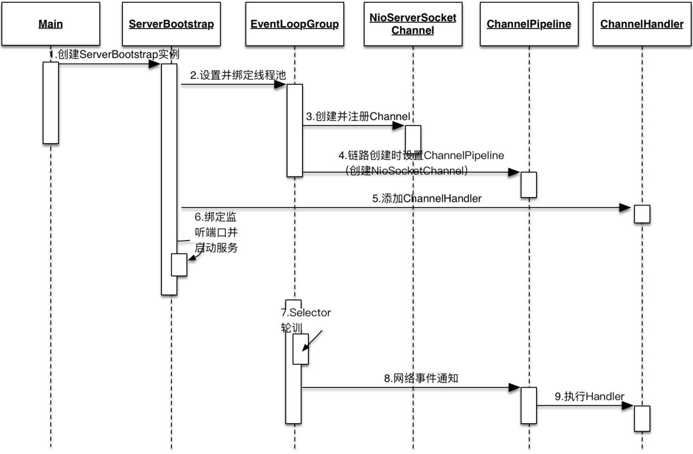
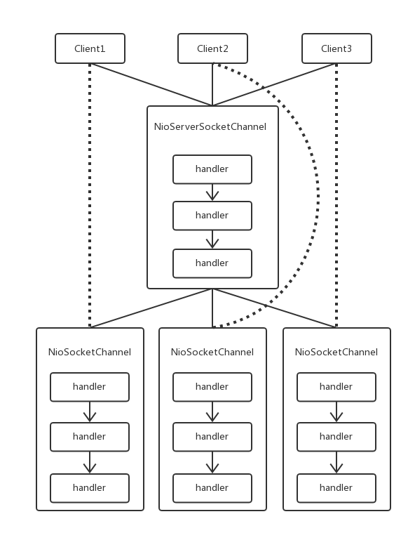
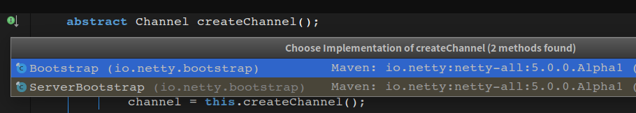
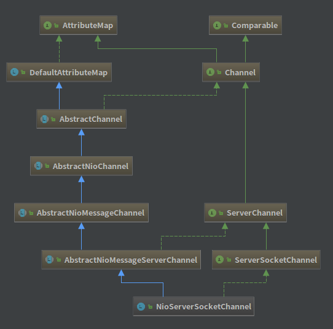

## Netty 源码分析(二) 服务端/客户端 创建


> 本篇为个人学习笔记，以《Netty 权威指南》中代码示例为实验样本。
>
> 个人代码仓库：https://github.com/FunriLy/AlgorithmDemo/tree/master/src/main/java/com/qg/fangrui/AlgorithmDemo/Netty


[TOC]


### 服务端创建

#### 一、服务端创建流程

一般情况下，使用Netty框架创建Server端服务的流程如下：

1. 创建ServerBootstrap实例
2. 设置EventLoopGroup
3. 设置创建的Channel类型
4. option配置属性
5. 设置Handler，处理请求
6. 设置ChildHandler，处理对应channel的请求
7. 通过bind创建Chnnel并绑定，启动服务


**其时序图如下：**



此图来源于网络，但是《Netty 权威指南》对于此图进行了非常详细的解读，在此就不在啰嗦介绍。

附上，《Netty 权威指南》PDF下载链接：


#### 二、服务端重要组件

#####　ServerBootstrap

ServerBootStrap是Netty服务端的启动辅助类，提供了一系列方法用于设置服务端参数和配置。

```java
public final class ServerBootstrap extends AbstractBootstrap<ServerBootstrap, ServerChannel> {
    private volatile ServerChannelFactory<? extends ServerChannel> channelFactory;
    private final Map<ChannelOption<?>, Object> childOptions = new LinkedHashMap();
    private final Map<AttributeKey<?>, Object> childAttrs = new LinkedHashMap();
    private volatile EventLoopGroup childGroup;
    private volatile ChannelHandler childHandler;
  	// 省略部分代码
}
```

由源码可见，ServerBootstrap继承了AbstractBootstrap，核心属性有childGroup和childHandler。其中，

- childGroup：负责调度和执行客户端接入、网络读写事件、用户自定义任务和定时任务的执行。
- childHandler：自定义的业务Handler。

##### Reactor 线程池

Netty的Reactor线程池是EventLoopGroup，实际上是一个EventLoop的数组。

而EventLoop的职责是处理所有注册到本线程多路复用器Selector上的Channel，Selector的轮询操作有EventLoop线程run方法驱动。

另外，用户自定义的任务和定时任务也是由统一的EventLoop负责处理。

##### Channel

这个是服务端Channel。作为NIO服务，需要创建ServerSocketChannel，Netty对原生的NIO类库进行了封装，对应实现是NioServerSocketChannel。

##### ChannelPipeline

ChannelPipeline本质是一个处理网络事件的职责链，负责管理和执行ChannelHandler。

##### Selector

由Reactor线程的NioEventLoop负责调度和执行Selector轮询操作，选择准备好的Channel集合。

##### Netty Handler 模型



Netty可以分别为启动辅助类和其父类指定Handler，子类中的Handler是NIOServerSocketChannel对应的ChannelPipeline的Handler；而父类中的Handler是客户端接入的连接SocketChannel对应的ChannelPipeline的Handler。

**两者的本质区别：**

ServerBootstrap中的Handler是NIOServerSocketChannel使用的，所有连接该监听端口的客户端都会执行它；父类AbstractBootstrap中的Handler是个工厂类，它会为每个新接入的客户端都创建一个Handler。


#### 三、服务端启动分析

启动服务端，基本上都需要指定EventLoopGroup(两个EventLoop：bossGroup处理客户端的连接请求，workerGroup处理网络读事件)，创建Channel(一般为NIOServerSocketChannel)和设置Handler处理器。

##### 1、创建Channel

服务端启动时首先创建，通过追踪定位，是由AbstractBootstrap的接口来创建NioServerSocketChannel，并交给ServerBootstrap子类来实现：



```java
    Channel createChannel() {
        EventLoop eventLoop = this.group().next();
        return this.channelFactory().newChannel(eventLoop, this.childGroup);
    }
```

该方法通过工厂类，利用了反射创建NioServerSocketChannel对象。主要有两个参数：前者是从父类NIO线程池中顺序获取一个NioEventLoop，它就是用于监听和接收客户端连接的Reactor线程；后者就是用于处理网络读写事件的Reactor线程。


##### 2、NioServerSocketChannel 分析




其改造方法：

```java
    private static java.nio.channels.ServerSocketChannel newSocket() {
        try {
            return java.nio.channels.ServerSocketChannel.open();
        } catch (IOException var1) {
            throw new ChannelException("Failed to open a server socket.", var1);
        }
    }

    public NioServerSocketChannel(EventLoop eventLoop, EventLoopGroup childGroup) {
        super((Channel)null, eventLoop, childGroup, newSocket(), 16);
    }
```

第一个参数名为`parent`，所以很容易判断它是构成链式关系的基础；

第二、三个参数是在设置EventLoop参数；

第四个参数是在构造ServerSocketChannel，用于通信；

最后一个参数值为16，其实是**SelectionKey.OP_ACCEPT**，即通知Selector只对于客户端的连接请求响应。

继续追踪到最底层，是AbstractChannel类的构造方法：

```java
    protected AbstractChannel(Channel parent, EventLoop eventLoop) {
        this.parent = parent;
        this.eventLoop = this.validate(eventLoop);
        this.unsafe = this.newUnsafe();
        this.pipeline = new DefaultChannelPipeline(this);
    }
```

可以看到多了两个属性，DefaultChannelPipeline是Handler的责任链；而Unsafe类，经过查阅资料，这是一个比重要的类(将在以后详细解读)：

```java
    protected AbstractUnsafe newUnsafe() {
        return new AbstractServerChannel.DefaultServerUnsafe();
    }
```

到这里，可以看到 NioServerSocketChannel 的初始化过程为：

- 调用NioServerSocketChannel.newSocket()方法创建`java.nio.channels.ServerSocketChannel`并作为参数传递下去。
- 设置parent为null，设置bossGroup。
- 实例化一个 AbstractUnsafe 对象，同时创建DefaultChannelPipeline对象。
- SelectableChannel ch 被配置为非阻塞的 **ch.configureBlocking(false)**。
- 类在`AbstractNioChannel`类中设置上面创建的ServerSocketChannel和设置监听事件为客户端接入事件。
- 在`AbstractNioMessageServerChannel`类中设置**workerGroup**。


###### 关于Pipeline的初始化

> Each channel has its own pipeline and it is created automatically when a new channel is created.

我们知道实例化一个Channel时，必定会实例化一个ChannelPipeline。在NioServerSocketChannel的初始化过程中实例化了 DefaultChannelPipeline。其构造器为：

```java
    public DefaultChannelPipeline(AbstractChannel channel) {
        if (channel == null) {
            throw new NullPointerException("channel");
        } else {
            this.channel = channel;
            DefaultChannelPipeline.TailHandler tailHandler = new DefaultChannelPipeline.TailHandler();
            this.tail = new DefaultChannelHandlerContext(this, (ChannelHandlerInvoker)null, this.generateName(tailHandler), tailHandler);
            DefaultChannelPipeline.HeadHandler headHandler = new DefaultChannelPipeline.HeadHandler(channel.unsafe());
            this.head = new DefaultChannelHandlerContext(this, (ChannelHandlerInvoker)null, this.generateName(headHandler), headHandler);
            this.head.next = this.tail;
            this.tail.prev = this.head;
        }
    }
```

构造DefaultChannelPipeline时，将NioServerSocketChannel对象保存在channel字段中，还有两个重要字段 head 和 tail，分别是一个双向链表的头部和尾部。

在DefaultChannelPipeline中，维护了一个以DefaultChannelHandlerContext为节点的双向链表。(这个部分也将在后来的分析中详细解读)


#### 3、Channel注册

初始化Channel后，继续跟踪源码`AbstractBootstrap`类：

```java
    final ChannelFuture initAndRegister() {
            channel = this.createChannel();
            this.init(channel);
        channel.unsafe().register(regFuture);
		// 去掉非关键代码
        return regFuture;
    }
```

PS：因为后面会详细介绍Unsafe类，这里先给其下一个非正式的定义`封装了对于底层Socket操作，作为Netty和Java底层交互的工具`。

接下来的调用的跳跃程度就有点大了，特此记录（PS：在这里跳了好几次错过了）

```
AbstractBootstrap.initAndRegister	->
Channel.register（接口）			 ->
AbstractChannel.register			->
AbstractChannel.register0（设置标志）	->
AbstractChannel.doRegister			->
AbstractNioChannel.doRegister（重载）->	END
```

最最最重要的一句代码是：

```java
this.selectionKey = this.javaChannel().register(this.eventLoop().selector, 0, this);
```

追踪这个`javaChannel()`可以得到一个SelectableChannel对象，它就是我们前面初始化的NioServerSocketChannel。

这句代码在这里表达的意思已经很明显了。

- 将NioServerSocketChannel注册我们的bossGroup的Selector上。


- 同时，参数 0 表示只是进行注册操作，不监听任何网络操作。原因如下：(**该解释来源于《Netty 权威指南》**)

  - 注册方法是多态的。

    该方法可以被NioServerSocketChannel用来监听客户端的接入，也可以注册SocketChannel用来监听读写操作。

  - 通过SelectionKey的interestOps(int ops)方法可以方便修改监听操作位。

    所以，注册需要获得SelectionKey并给AbstractNioChannel的成员变量赋值。