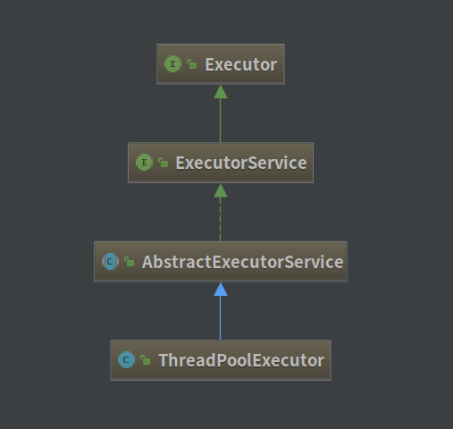

## ThreadPoolExecutor 源码解析：探索 Java 线程池

[TOC]

### 一、类图



Wiki 上是这样解释的：[Thread Pool](https://en.wikipedia.org/wiki/Thread_pool)


作用：**利用线程池可以大大减少在创建和销毁线程上所花的时间以及系统资源的开销！**


### 二、ThreadPoolExecutor 定义

```java
public class ThreadPoolExecutor extends AbstractExecutorService {}
```


### 三、ThreadPoolExecutor 构造方法

```java
	// 最长的构造方法，其他方法基本也是基于此方法
	public ThreadPoolExecutor(int corePoolSize,						// 核心线程数
                              int maximumPoolSize,					// 线程池最大线程数
                              long keepAliveTime, // 表示线程没有任务执行时最多保持多久时间会终止
                              TimeUnit unit,	  // 参数keepAliveTime的时间单位
                              BlockingQueue<Runnable> workQueue,
                              // 阻塞队列，用来存储等待执行的任务
                              ThreadFactory threadFactory, // 线程工厂，主要用来创建线程
                              RejectedExecutionHandler handler) { // 拒绝处理任务的策略
        if (corePoolSize < 0 ||
            maximumPoolSize <= 0 ||
            maximumPoolSize < corePoolSize ||
            keepAliveTime < 0)
            throw new IllegalArgumentException();
        if (workQueue == null || threadFactory == null || handler == null)
            throw new NullPointerException();
        this.corePoolSize = corePoolSize;	
        this.maximumPoolSize = maximumPoolSize;
        this.workQueue = workQueue;
        this.keepAliveTime = unit.toNanos(keepAliveTime);
        this.threadFactory = threadFactory;
        this.handler = handler;
    }
```

七个重要参数：

- corePoolSize：核心线程数。
- maximumPoolSize：线程池最大线程数。
- keepAliveTime： 表示线程没有任务执行时最多保持多久时间会终止。
- unit：参数keepAliveTime的时间单位（DAYS、HOURS、MINUTES、SECONDS 等）
- workQueue：阻塞队列，用来存储等待执行的任务
  - ArrayBlockingQueue(有界队列)
  - LinkedBlockingQueue(无界队列)
  - SynchronousQueue
- threadFactory：线程工厂，主要用来创建线程
- handler：拒绝处理任务的策略
  - AbortPolicy：丢弃任务并抛出 RejectedExecutionException 异常(默认)
  - DiscardPolicy：丢弃任务，但是不抛出异常
  - DiscardOldestPolicy：丢弃队列最前面的任务，然后重新尝试执行任务
  - CallerRunsPolicy：由调用线程处理该任务
  - 自定义拒绝策略。


### 四、ThreadPoolExecutor 执行顺序及参数设置

#### 1、执行顺序

- 当线程数小于核心线程数时，创建线程。
- 当线程数大于等于核心线程数时，且任务队列未满，将任务加入到任务队列。
- 当线程数大于等于核心线程数时，且任务队列已满：
  - 若线程数小于最大线程数，创建线程。
  - 若线程数等于最大线程数，抛出异常，拒绝任务(默认)。


#### 2、参数设置

几个重要的值：

1. tasks ：每秒的任务数，假设为500~1000
2. taskcost：每个任务花费时间，假设为0.1s 
3. responsetime：系统允许容忍的最大响应时间，假设为1s
   ​

- corePoolSize = 每秒需要多少个线程处理？ 
  - threadcount = tasks/(1/taskcost) =tasks * taskcout = (500~1000) * 0.1 = 50~100 个线程。corePoolSize设置应该大于50 
  - 根据8020原则，如果80%的每秒任务数小于800，那么corePoolSize设置为80即可 
- queueCapacity = (coreSizePool/taskcost)*responsetime *
  - 计算可得 queueCapacity = 80/0.1*1 = 80。意思是队列里的线程可以等待1s，超过了的需要新开线程来执行 
  - 切记不能设置为Integer.MAX_VALUE，这样队列会很大，线程数只会保持在corePoolSize大小，当任务陡增时，不能新开线程来执行，响应时间会随之陡增。 
- maxPoolSize = (max(tasks)- queueCapacity)/(1/taskcost) 
  - 计算可得 maxPoolSize = (1000-80)/10 = 92 
  - （最大任务数-队列容量）/每个线程每秒处理能力 = 最大线程数 
- rejectedExecutionHandler：根据具体情况来决定，任务不重要可丢弃，任务重要则要利用一些缓冲机制来处理 
- keepAliveTime和allowCoreThreadTimeout采用默认通常能满足


### 五、重要方法

重要方法有两个：execute() 用来向线程池提交一个任务；shutdown() 可以关闭线程池。

#### 1、execute() 方法

```java
    public void execute(Runnable command) {
        if (command == null)
            throw new NullPointerException();
        int c = ctl.get();
      	// 如果当前线程的线程数小于核心线程数，创建新的线程
      	// addWorker自动的检查当前线程池的状态和Worker的数量
      	// 防止线程池在不能添加线程的状态下添加线程
        if (workerCountOf(c) < corePoolSize) {
            if (addWorker(command, true))
                return;
            c = ctl.get();
        }
      	// 进行 二次检查 的，因为线程在入队之后状态是可能会发生变化的
        if (isRunning(c) && workQueue.offer(command)) {
            int recheck = ctl.get();
          	// recheck防止线程池状态的突变
          	// 如果突变，那么将 reject 线程，防止 workQueue 中增加新线程
            if (! isRunning(recheck) && remove(command))
                reject(command);
            else if (workerCountOf(recheck) == 0)
                addWorker(null, false);
        }
      	// 如果 task 不能入队(队列满了)
      	// 尝试增加一个新线程，如果增加失败那么当前的线程池状态变化了或者线程池已经满了然后拒绝task
        else if (!addWorker(command, false))
            reject(command);
    }
```

其中调用了 addWorker() 方法。

```java
    /**
     * @param firstTask 新增一个线程并执行这个任务
     * @param core 是否使用 corePoolSize 作为上限，否则使用 maxmunPoolSize
     */
	private boolean addWorker(Runnable firstTask, boolean core) {
        retry:	// 标志
        for (;;) {
            int c = ctl.get();
            int rs = runStateOf(c);
          	// rs!=Shutdown || fistTask！=null || workQueue.isEmpty
            if (rs >= SHUTDOWN && // 如果当前的线程池的状态 > SHUTDOWN 那么拒绝
                ! (rs == SHUTDOWN &&	// 如果等于SHUTDOWN，那么不能新加入不为 null 的 Task
                   firstTask == null && // 如果在 workQueue 为空的时候不能加入任何类型的 Worker
                   ! workQueue.isEmpty())) // 如果不为空时可以加入 task 为 null 的 Worker
                return false;
            for (;;) {
                int wc = workerCountOf(c)；
                if (wc >= CAPACITY ||	// 如果当前的数量超过了CAPACITY
                    // 或者超过了 corePoolSize 和 maximumPoolSize
                    wc >= (core ? corePoolSize : maximumPoolSize))
                    return false;
              	// CAS 尝试增加线程数，如果失败，证明有竞争，那么重新到 retry
                if (compareAndIncrementWorkerCount(c))
                    break retry;
                c = ctl.get();  // Re-read ctl
              	// 判断当前线程池的运行状态,状态发生改变，重试 retry;
                if (runStateOf(c) != rs)
                    continue retry;
            }
        }
        boolean workerStarted = false;
        boolean workerAdded = false;
        Worker w = null;
        try {
          	// Worker 为内部类，封装了线程和任务
          	// 通过 ThreadFactory 创建线程，可能失败抛异常或者返回 null
            w = new Worker(firstTask);
            final Thread t = w.thread;
            if (t != null) {
                final ReentrantLock mainLock = this.mainLock;
                mainLock.lock();
                try {
                    int rs = runStateOf(ctl.get());
                    if (rs < SHUTDOWN ||
                        (rs == SHUTDOWN && firstTask == null)) {
                        if (t.isAlive()) // precheck that t is startable
                            throw new IllegalThreadStateException();
                        workers.add(w);
                        int s = workers.size();
                        if (s > largestPoolSize)
                            largestPoolSize = s;
                        workerAdded = true;
                    }
                } finally {
                    mainLock.unlock();
                }
                if (workerAdded) {
                    t.start();
                    workerStarted = true;
                }
            }
        } finally {
            if (! workerStarted)
              	// 失败回退,从 wokers 移除 w, 线程数减一，尝试结束线程池
                addWorkerFailed(w);
        }
        return workerStarted;
    }
```


**执行流程：**

1. 当有任务进入时，线程池创建线程去执行任务，直到核心线程数满为止；
2. 核心线程数量满了之后，任务就会进入一个缓冲的任务队列中；
   - 若任务队列是无界队列时，任务会一直放入缓冲任务队列中；
   - 若任务队列是有界队列时，任务会先放到缓冲队列中。当任务队列满了就放入到线程池中，此时会与线程池中最大线程数量做一个比较，如果超出了则默认抛出异常。
3. 如果一个线程完成了任务，会从队列中取出下一个任务来执行。
4. 当线程池中的线程数量大于 corePoolSize时，如果某线程空闲时间超过keepAliveTime，线程将被终止。
5. 如果核心线程corePoolSize、任务队列workQueue、最大线程maximumPoolSize，如果三者都满了，使用handler处理被拒绝的任务。


#### 2、shutdown() 方法

```java
    public void shutdown() {
        final ReentrantLock mainLock = this.mainLock;
        mainLock.lock();		// 加锁
        try {
            checkShutdownAccess();		// 判断是否可以操作目标线程
            advanceRunState(SHUTDOWN);	// 设置线程池状态为 SHUTDOWN, 线程池中不会增加新任务
            interruptIdleWorkers();		// 中断所有空闲线程
            onShutdown(); // hook for ScheduledThreadPoolExecutor
        } finally {
            mainLock.unlock();	// 释放锁
        }
        tryTerminate();	// 从 SHUTDOWN 状态转到 TERMINATED 状态，关闭线程池
    }

```

打断空闲线程：

```java
    private void interruptIdleWorkers(boolean onlyOne) {
        final ReentrantLock mainLock = this.mainLock;
        mainLock.lock();
        try {
            for (Worker w : workers) { // 遍历workers 对所有worker做中断处理。
                Thread t = w.thread;
                if (!t.isInterrupted() && w.tryLock()) {
                    try {
                        t.interrupt();
                    } catch (SecurityException ignore) {
                    } finally {
                        w.unlock();
                    }
                }
                if (onlyOne)
                    break;
            }
        } finally {
            mainLock.unlock();
        }
    }
```


### 六、不同线程池

#### 1、JDK 四种线程池

- **newFixedThreadPool**

  创建一个定长线程池，可控制线程最大并发数，超出的线程会在队列中等待。

- **newSingleThreadExecutor**

  创建一个单线程化的线程池，它只会用唯一的工作线程来执行任务，保证所有任务按照指定顺序(FIFO, LIFO, 优先级)执行。

- **newCachedThreadPool**

  创建一个可缓存线程池，如果线程池长度超过处理需要，可灵活回收空闲线程，若无可回收，则新建线程。

- **newScheduledThreadPool**

  创建一个定长线程池，支持定时及周期性任务执行。


#### 2、自定义线程池的实现

先定义一个线程类：

```java
public class MyTask implements Runnable {
    private int id;
    private String name;
    public MyTask(int id, String name) {
        this.id = id;
        this.name = name;
    }
	/**
	 * get & set 方法
	 */
    @Override
    public void run() {
        System.out.println("ID:" + id + ", Name:" + name);
        try {
            Thread.sleep(1000);
        } catch (InterruptedException e) {
            e.printStackTrace();
        }
    }
}
```


然后再实现一个自定义的拒绝策略，重写了 rejectedExecution() 方法：

```java
public class MyRejectedHandler implements RejectedExecutionHandler {
    @Override
    public void rejectedExecution(Runnable r, ThreadPoolExecutor executor) {
        MyTask task = (MyTask) r;
        System.out.println("报警信息：" + task.getName() + " 被线程池拒绝，没有被执行");
    }
}
```

实验：

```java
public class MyThreadPoolTest {
    public static void main(String[] args) {
        ThreadPoolExecutor pool = new ThreadPoolExecutor(// 自定义一个线程池
                1, // coreSize
                2, // maxSize
                60, // 60s
                TimeUnit.SECONDS, new ArrayBlockingQueue<Runnable>(3) // 有界队列，容量是3个
                , Executors.defaultThreadFactory()
                , new MyRejectedHandler()
        );
        for (int i=0; i<6; i++){	// 开启6个线程
            pool.execute(new MyTask(i, "任务"+i));
            System.out.println("活跃的线程数："+pool.getActiveCount() + ",核心线程数：" 
                               + pool.getCorePoolSize() + ",线程池大小：" 
                               + pool.getPoolSize() + ",队列的大小" 
                               + pool.getQueue().size());
        }
        pool.shutdown();	// 安全关闭线程池
    }
}
```

测试结果：

```json
ID:0, Name:任务0	// 执行线程0
活跃的线程数：1,核心线程数：1,线程池大小：1,队列的大小0	// 队列现状
活跃的线程数：1,核心线程数：1,线程池大小：1,队列的大小1	// 将线程1放入等待队列
活跃的线程数：1,核心线程数：1,线程池大小：1,队列的大小2	// 将线程2放入等待队列
活跃的线程数：1,核心线程数：1,线程池大小：1,队列的大小3 // 将线程3放入等待队列
活跃的线程数：2,核心线程数：1,线程池大小：2,队列的大小3 // 队列已满，将线程4直接放入线程池中
ID:4, Name:任务4	// 执行线程4
报警信息：任务5 被线程池拒绝，没有被执行	// 线程5，因为队列与线程池已满，执行拒绝策略
活跃的线程数：2,核心线程数：1,线程池大小：2,队列的大小3
ID:1, Name:任务1	// 执行线程1
ID:2, Name:任务2	// 执行线程2
ID:3, Name:任务3	// 执行线程3
```


### 七、参考资料

- [多线程线程池和自定义线程池](http://www.jianshu.com/p/0d548f0646fc)
- [Java 自定义线程池](http://www.cnblogs.com/nele/p/6502750.html)
- [Java 线程池艺术探究](http://www.54tianzhisheng.cn/2017/07/29/ThreadPool/)