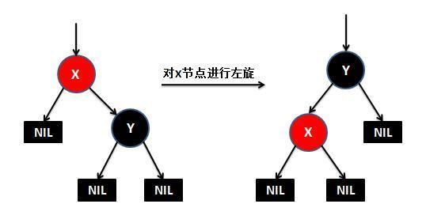
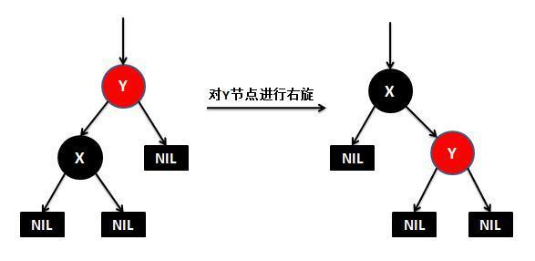

## 红黑树之 Java 实现

[TOC]

### 一、红黑树简介

红黑树(Red-Black Tree，简称R-B Tree)，它是一种特殊的二叉查找树。

其特征是：

- 包括了二叉树的特点：左孩子 < 父母节点 < 右孩子
- 每个节点都只能是红色或者黑色
- 根节点是黑色
- 每个叶节点必须是 null 的黑色节点
- 如果一个结点是红的，则它两个子节点都是黑的。也就是说在一条路径上不能出现相邻的两个红色结点。
- 从一个节点到该节点的子孙节点的所有路径上包含相同数目的黑节点。

#### 二、红黑树的实现

红黑树的基本操作是是**添加**、**删除**和**旋转**。当添加或删除红黑树中的节点之后，可能需要进行旋转，其目的是让树保持红黑树的特性。旋转包括两种：**左旋** 和 **右旋**。

> 不涉及具体代码实现，可以参考相应的源码地址。

#### 1、左旋：

#### 2、右旋：

#### 3、添加

将一个节点插入到红黑树中：

- 将红黑树当作一颗二叉查找树，将节点插入。
- 将插入的节点着色为红色(满足红黑树特征 6)。
- 通过一系列的旋转或着色等操作，使之重新成为一颗红黑树(针对红黑树特征 5)。

#### 4、删除

- 将红黑树当作一颗二叉查找树，将节点删除(三种情况)。

  - 被删除节点没有儿子，即为叶节点。那么，直接将该节点删除。

  - 被删除节点只有一个儿子。那么，直接删除该节点，并用该节点的唯一子节点顶替它的位置。

  - 被删除节点有两个儿子。

    那么，先找出它的后继节点；然后把“它的后继节点的内容”复制给“该节点的内容”；之后，删除“它的后继节点”。同时，“后继节点”不可能存在两个儿子，则按照前两种情况进行处理。

- 通过"旋转和重新着色"等一系列来修正该树，使之重新成为一棵红黑树。

### 三、实现

- [红黑树之 Java 实现](https://github.com/FunriLy/AlgorithmDemo/blob/master/src/main/java/com/qg/fangrui/AlgorithmDemo/algorithm/RBTree.java)

### 四、参考资料

- http://www.cnblogs.com/skywang12345/p/3624343.html
- https://tech.meituan.com/redblack-tree.html