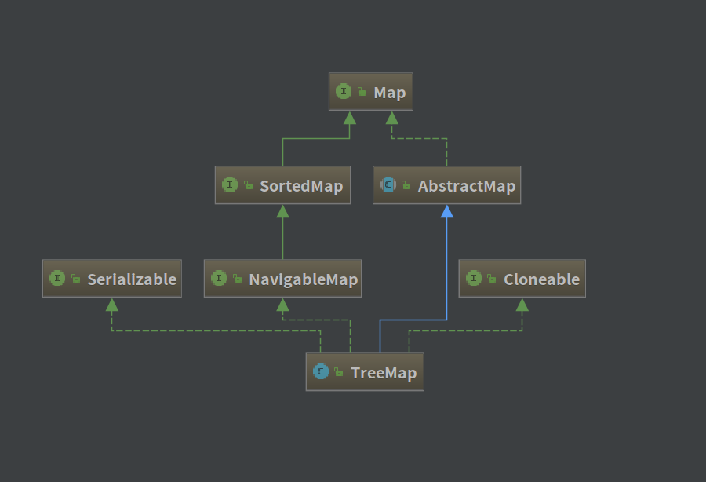

##  TreeMap 源码解析

[TOC]

 ### 一、类图

------------------------------------




### 二、TreeMap 定义

--------------------------------------------

```java
public class TreeMap<K,V> extends AbstractMap<K,V>
    implements NavigableMap<K,V>, Cloneable, java.io.Serializable
```

- TreeMap 是一个**有序的 Key-Value 集合**，它是通过红黑树来实现的。
- TreeMap 继承了 AbstractMap。
- TreeMap 实现了 NavigableMap，支持返回有序的 key 集合等操作。
- TreeMap 实现了 Cloneable，能够被克隆。
- TreeMap 实现了 Serializable，能够进行序列化传输。

TreeMap 是基于红黑树实现的，根据据**其键的自然顺序进行排序**，或者根据**创建映射时提供的 Comparator 进行排序**，具体取决于使用的构造方法。同时，TreeMap 的基本操作 containsKey、get、put 和 remove 的时间复杂度是 log(n)。TreeMap 也是一种非同步的集合。


### 三、TreeMap 属性

--------------------------------

```java
    // 比较器
	private final Comparator<? super K> comparator;
	// 红黑树的根节点
    private transient Entry<K,V> root;
	// 集合中元素数量
    private transient int size = 0;
	// fail-fast 机制的计数器
    private transient int modCount = 0;
```

**节点定义：**

```java
    static final class Entry<K,V> implements Map.Entry<K,V> {
        K key;
        V value;
        Entry<K,V> left;
        Entry<K,V> right;
        Entry<K,V> parent;
        boolean color = BLACK;
		/**
		 * 省略 构造器、get、set、toString 方法
		 */
		// 重写 equals、hashCode 方法，方便进行比较
        public boolean equals(Object o) {
            if (!(o instanceof Map.Entry))
                return false;
            Map.Entry<?,?> e = (Map.Entry<?,?>)o;
            return valEquals(key,e.getKey()) && valEquals(value,e.getValue());
        }

        public int hashCode() {
            int keyHash = (key==null ? 0 : key.hashCode());
            int valueHash = (value==null ? 0 : value.hashCode());
            return keyHash ^ valueHash;
        }
    }

```


### 四、TreeMap 构造方法

------------------------------------

```java
	// 采用默认构造方法，使用key的自然顺序来维持TreeMap的顺序
    public TreeMap() {
        comparator = null;
    }
	// 采用指定的比较器来构造
    public TreeMap(Comparator<? super K> comparator) {
        this.comparator = comparator;
    }
	// 利用 Map 构造一个 TreeMap
    public TreeMap(Map<? extends K, ? extends V> m) {
        comparator = null;
        putAll(m);
    }
	// 利用 SortedMap 构造一个 TreeMap，采用 SortedMap 的比较器
    public TreeMap(SortedMap<K, ? extends V> m) {
        comparator = m.comparator();
        try {
            buildFromSorted(m.size(), m.entrySet().iterator(), null, null);
        } catch (java.io.IOException cannotHappen) {
        } catch (ClassNotFoundException cannotHappen) {
        }
    }
```


### 五、TreeMap 重要方法解析

-----------------------------------------------

#### 1、插入

```java
    public V put(K key, V value) {
        Entry<K,V> t = root;
        if (t == null) {	// 如果根节点为空，则直接创造一个节点并返回
            compare(key, key); // type (and possibly null) check 类型检查
            root = new Entry<>(key, value, null);
            size = 1;
            modCount++;
            return null;
        }
        int cmp;
       	Entry<K,V> parent;	
        Comparator<? super K> cpr = comparator;	// 确定比较器
        if (cpr != null) {	
            do {		// do……while 循环找到key值的插入点
                parent = t;	// 记录上次循环的节点
                cmp = cpr.compare(key, t.key);	// 比较大小
                if (cmp < 0)
                    t = t.left;
                else if (cmp > 0)
                    t = t.right;
                else
                    return t.setValue(value);
            } while (t != null);	// 找不到继续往下的比较节点
        }
        else {	// 如果比较器为空，则使用key作为比较器进行比较
            if (key == null)	// key 不能为空，必须实现 Comparable 接口
                throw new NullPointerException();
            @SuppressWarnings("unchecked")
                Comparable<? super K> k = (Comparable<? super K>) key;
            do {		// 找到插入位置并插入节点
                parent = t;
                cmp = k.compareTo(t.key);
                if (cmp < 0)
                    t = t.left;
                else if (cmp > 0)
                    t = t.right;
                else
                    return t.setValue(value);
            } while (t != null);
        }
      	// 找到新节点的父节点，并创造节点对象
        Entry<K,V> e = new Entry<>(key, value, parent);
        if (cmp < 0)	// 确定新节点是在父节点的哪一侧
            parent.left = e;
        else
            parent.right = e;
        fixAfterInsertion(e);	// 插入新节点后为了保持红黑树平衡，对树进行调整
        size++;
        modCount++;
        return null;
    }

	// 新增节点后对红黑树进行调整
    private void fixAfterInsertion(Entry<K,V> x) {
        x.color = RED;	// 将新插入节点设置为红色
      	// 保证新插入节点x不是根节点或者新插入节点x的父节点不是红色(因为这两种情况不需要调整)
        while (x != null && x != root && x.parent.color == RED) {
          	// 如果新插入节点的父节点是祖父节点的左孩子
            if (parentOf(x) == leftOf(parentOf(parentOf(x)))) {
                Entry<K,V> y = rightOf(parentOf(parentOf(x)));	// 获取叔叔节点
                if (colorOf(y) == RED) {	// 如果父亲节点是红色的，
                    setColor(parentOf(x), BLACK);	// 将父亲节点一代设置为黑色
                    setColor(y, BLACK);
                    setColor(parentOf(parentOf(x)), RED);	// 将祖父节点设置为红色
                    x = parentOf(parentOf(x)); 				// 循环上去
                } else {
                  	// 如果节点的叔叔节点是黑色或者null，且父节点是祖父节点的左孩子
                    if (x == rightOf(parentOf(x))) {
                        x = parentOf(x);	
                        rotateLeft(x);	// 左旋父节点
                    }
                  	// 如果节点的叔叔节点是黑色或者null，且父节点是祖父节点的右孩子
                    setColor(parentOf(x), BLACK);
                    setColor(parentOf(parentOf(x)), RED);
                    rotateRight(parentOf(parentOf(x)));	// 右旋父节点
                }
            } else {	// 如果新插入节点的父节点是祖父节点的右孩子
                Entry<K,V> y = leftOf(parentOf(parentOf(x)));
                if (colorOf(y) == RED) {
                    setColor(parentOf(x), BLACK);
                    setColor(y, BLACK);
                    setColor(parentOf(parentOf(x)), RED);
                    x = parentOf(parentOf(x));
                } else {
                    if (x == leftOf(parentOf(x))) {
                        x = parentOf(x);
                        rotateRight(x);
                    }
                    setColor(parentOf(x), BLACK);
                    setColor(parentOf(parentOf(x)), RED);
                    rotateLeft(parentOf(parentOf(x)));
                }
            }
        }
        root.color = BLACK;
    }

```


#### 2、左旋和右旋

```java
  	// 左旋
	private void rotateLeft(Entry<K,V> p) {
        if (p != null) {
            Entry<K,V> r = p.right;
            p.right = r.left;
            if (r.left != null)
                r.left.parent = p;
            r.parent = p.parent;
            if (p.parent == null)
                root = r;
            else if (p.parent.left == p)
                p.parent.left = r;
            else
                p.parent.right = r;
            r.left = p;
            p.parent = r;
        }
    }

    // 右旋
    private void rotateRight(Entry<K,V> p) {
        if (p != null) {
            Entry<K,V> l = p.left;
            p.left = l.right;
            if (l.right != null) l.right.parent = p;
            l.parent = p.parent;
            if (p.parent == null)
                root = l;
            else if (p.parent.right == p)
                p.parent.right = l;
            else p.parent.left = l;
            l.right = p;
            p.parent = l;
        }
    }
```


#### 3、删除

关于红黑树删除的情况就比较复杂了，需要考虑颜色和平衡的问题。

具体可以参考博文：http://www.jianshu.com/p/fc5e16b5c674 。因为该篇博文记录得很详细，就不班门弄斧了。

```java
    public V remove(Object key) {
        Entry<K,V> p = getEntry(key);	// 找到删除的节点
        if (p == null)
            return null;
        V oldValue = p.value;	// 记录节点，供返回使用
        deleteEntry(p);
        return oldValue;
    }

    private void deleteEntry(Entry<K,V> p) {
        modCount++;
        size--;

        // 如果被删除节点的左右孩子均不为空，
        if (p.left != null && p.right != null) {
            Entry<K,V> s = successor(p);	// 查找可替代节点
            p.key = s.key;
            p.value = s.value;
            p = s;
        } // p has 2 children
        // 找到替代节点的继承者
        Entry<K,V> replacement = (p.left != null ? p.left : p.right);

        if (replacement != null) {	
            replacement.parent = p.parent;	//将p父节点拷贝给替代节点
            if (p.parent == null)	// 根节点
                root = replacement;
            else if (p == p.parent.left)	// 替代节点接替被删除节点 p
                p.parent.left  = replacement;
            else
                p.parent.right = replacement;

            // 将p的left、right、parent的指针都指向空，即解除前后引用关系
            p.left = p.right = p.parent = null;

            // 如果p的颜色是黑色，则需要调整红黑树以保持其平衡
            if (p.color == BLACK)
                fixAfterDeletion(replacement);
        } else if (p.parent == null) { // 被删除节点为根节点
            root = null;
        } else { //  p 节点没有孩子
            if (p.color == BLACK)
                fixAfterDeletion(p);

            if (p.parent != null) {
                if (p == p.parent.left)
                    p.parent.left = null;
                else if (p == p.parent.right)
                    p.parent.right = null;
                p.parent = null;
            }
        }
    }

    /** From CLR */
    private void fixAfterDeletion(Entry<K,V> x) {
      	// while循环，保证要删除节点x不是跟节点，并且是黑色（根节点和红色不需要调整）
        while (x != root && colorOf(x) == BLACK) {
          	// 如果要删除节点x是其父亲的左孩子
            if (x == leftOf(parentOf(x))) {
                Entry<K,V> sib = rightOf(parentOf(x));
				// 如果删除节点x的兄弟节点是红色
                if (colorOf(sib) == RED) {
                    setColor(sib, BLACK);
                    setColor(parentOf(x), RED);
                    rotateLeft(parentOf(x));
                    sib = rightOf(parentOf(x));
                }
				// 如果x的兄弟节点的两个孩子都是黑色
                if (colorOf(leftOf(sib))  == BLACK &&
                    colorOf(rightOf(sib)) == BLACK) {
                    setColor(sib, RED);
                    x = parentOf(x);
                } else {
                  	// 如果x的兄弟节点右孩子是黑色，左孩子是红色
                    if (colorOf(rightOf(sib)) == BLACK) {
                        setColor(leftOf(sib), BLACK);
                        setColor(sib, RED);
                        rotateRight(sib);	// 右旋
                        sib = rightOf(parentOf(x));
                    }
                  	// 如果x的兄弟节点右孩子是红色
                    setColor(sib, colorOf(parentOf(x)));
                    setColor(parentOf(x), BLACK);
                    setColor(rightOf(sib), BLACK);
                    rotateLeft(parentOf(x));	// 左旋
                    x = root;	// 达到平衡，退出循环
                }
            } else { // 如果要删除节点x是其父亲的右孩子，同理
                Entry<K,V> sib = leftOf(parentOf(x));

                if (colorOf(sib) == RED) {
                    setColor(sib, BLACK);
                    setColor(parentOf(x), RED);
                    rotateRight(parentOf(x));
                    sib = leftOf(parentOf(x));
                }

                if (colorOf(rightOf(sib)) == BLACK &&
                    colorOf(leftOf(sib)) == BLACK) {
                    setColor(sib, RED);
                    x = parentOf(x);
                } else {
                    if (colorOf(leftOf(sib)) == BLACK) {
                        setColor(rightOf(sib), BLACK);
                        setColor(sib, RED);
                        rotateLeft(sib);
                        sib = leftOf(parentOf(x));
                    }
                    setColor(sib, colorOf(parentOf(x)));
                    setColor(parentOf(x), BLACK);
                    setColor(leftOf(sib), BLACK);
                    rotateRight(parentOf(x));
                    x = root;
                }
            }
        }

        setColor(x, BLACK);
    }
```


#### 4、查询

```java
	// 根据键值查找节点
    public V get(Object key) {
        Entry<K,V> p = getEntry(key);
        return (p==null ? null : p.value);
    }

    final Entry<K,V> getEntry(Object key) {
        // Offload comparator-based version for sake of performance
        if (comparator != null)	// 比较器不为空
            return getEntryUsingComparator(key);	//采用比较器进行比较
        if (key == null)
            throw new NullPointerException();
        @SuppressWarnings("unchecked")
            Comparable<? super K> k = (Comparable<? super K>) key;
        Entry<K,V> p = root;	// 从根节点开始
        while (p != null) {		// 根据比较器判断是在左子树还是右子树(默认比较器，比较key值)
            int cmp = k.compareTo(p.key);
            if (cmp < 0)
                p = p.left;
            else if (cmp > 0)
                p = p.right;
            else
                return p;
        }
        return null;
    }
	// 根据比较器来查找
    final Entry<K,V> getEntryUsingComparator(Object key) {
        @SuppressWarnings("unchecked")
            K k = (K) key;
        Comparator<? super K> cpr = comparator;	// 获取比较器
        if (cpr != null) {
            Entry<K,V> p = root;	// 从根节点开始使用重写的比较器进行遍历
            while (p != null) {
                int cmp = cpr.compare(k, p.key);
                if (cmp < 0)
                    p = p.left;
                else if (cmp > 0)
                    p = p.right;
                else
                    return p;
            }
        }
        return null;
    }
```


