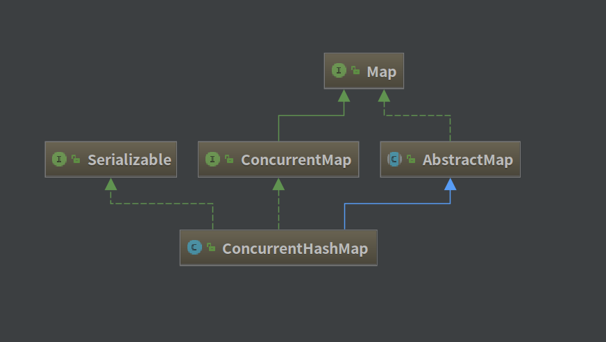
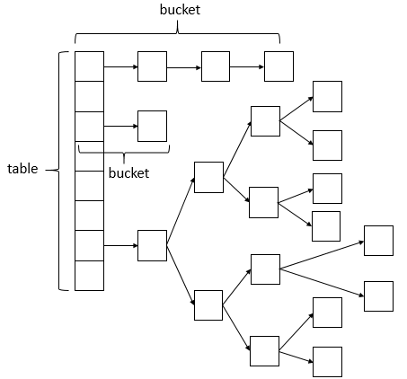
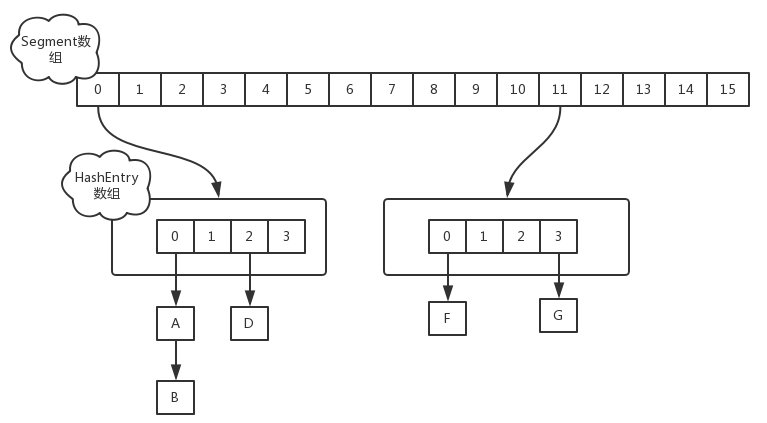

##  ConcurrentHashMap 源码解析

[TOC]

### 一、类图

---------------------------------

果然加了多线程控制之后，ConcurrentHashMap 没有那么好理解了，**建议先阅读理解HashMap和TreeMap源码后再来看比较好**，并且要静下心来多看几遍！！！




ConcurrentHashMap 相对于 HashMap 来说，是多线程安全的，其底层的数据结构与 HashMap 是相同的(JDK 1.8)，如下：




### 二、ConcurrentHashMap 定义

```java
public class ConcurrentHashMap<K,V> extends AbstractMap<K,V>
    implements ConcurrentMap<K,V>, Serializable {}
```

- ConcurrentHashMap 的数据结构是 **数组+链表+红黑树** 实现的，红黑树是为了提高查找效率。
- ConcurrentHashMap 是一种线程安全的数据结构。


看完ConcurrentHashMap整个类的源码，给自己的感觉就是和HashMap的实现基本一模一样，当有修改操作时借助了synchronized来对table[i]进行锁定保证了线程安全以及使用了CAS来保证原子性操作，其它的基本一致，例如：ConcurrentHashMap的get(int key)方法的实现思路为：根据key的hash值找到其在table所对应的位置i,然后在table[i]位置所存储的链表(或者是树)进行查找是否有键为key的节点，如果有，则返回节点对应的value，否则返回null。思路是不是很熟悉，是不是和HashMap中该方法的思路一样。所以，如果你也在看ConcurrentHashMap的源码，不要害怕，思路还是原来的思路，只是多了些许东西罢了。


### 三、ConcurrentHashMap  属性

```java
    // 表的最大容量
    private static final int MAXIMUM_CAPACITY = 1 << 30;
    // 默认表的大小
    private static final int DEFAULT_CAPACITY = 16;
    // 最大数组大小
    static final int MAX_ARRAY_SIZE = Integer.MAX_VALUE - 8;
    // 默认并发数
    private static final int DEFAULT_CONCURRENCY_LEVEL = 16;
    // 装载因子
    private static final float LOAD_FACTOR = 0.75f;
    // 转化为红黑树的阈值
    static final int TREEIFY_THRESHOLD = 8;
    // 由红黑树转化为链表的阈值
    static final int UNTREEIFY_THRESHOLD = 6;
    // 转化为红黑树的表的最小容量
    static final int MIN_TREEIFY_CAPACITY = 64;
    // 每次进行转移的最小值
    private static final int MIN_TRANSFER_STRIDE = 16;
    // 生成sizeCtl所使用的bit位数
    private static int RESIZE_STAMP_BITS = 16;
    // 进行扩容所允许的最大线程数
    private static final int MAX_RESIZERS = (1 << (32 - RESIZE_STAMP_BITS)) - 1;
    // 记录sizeCtl中的大小所需要进行的偏移位数
    private static final int RESIZE_STAMP_SHIFT = 32 - RESIZE_STAMP_BITS;  
    // 一系列的标识
    static final int MOVED     = -1; // hash for forwarding nodes
    static final int TREEBIN   = -2; // hash for roots of trees
    static final int RESERVED  = -3; // hash for transient reservations
    static final int HASH_BITS = 0x7fffffff; // usable bits of normal node hash
    // 获取可用的CPU个数
    static final int NCPU = Runtime.getRuntime().availableProcessors();
    // 进行序列化的属性
    private static final ObjectStreamField[] serialPersistentFields = {
        new ObjectStreamField("segments", Segment[].class),
        new ObjectStreamField("segmentMask", Integer.TYPE),
        new ObjectStreamField("segmentShift", Integer.TYPE)
    };
    // 表
    transient volatile Node<K,V>[] table;
    // 下一个表
    private transient volatile Node<K,V>[] nextTable;
    // 基本计数
    private transient volatile long baseCount;
    // 对表初始化和扩容控制
    private transient volatile int sizeCtl;
    // 扩容下另一个表的索引
    private transient volatile int transferIndex;
    // 旋转锁
    private transient volatile int cellsBusy;
    // 视图
    private transient KeySetView<K,V> keySet;
    private transient ValuesView<K,V> values;
    private transient EntrySetView<K,V> entrySet;
    // Unsafe mechanics 不安全的机制
    private static final sun.misc.Unsafe U;
    private static final long SIZECTL;
    private static final long TRANSFERINDEX;
    private static final long BASECOUNT;
    private static final long CELLSBUSY;
    private static final long CELLVALUE;
    private static final long ABASE;
    private static final int ASHIFT;
```

ConcurrentHashMap 添加了 Unsafe 实例，主要是用于反射获取对象对应的字段。如下：

```java
    static {
        try {
            U = sun.misc.Unsafe.getUnsafe();
            Class<?> k = ConcurrentHashMap.class;
            SIZECTL = U.objectFieldOffset
                (k.getDeclaredField("sizeCtl"));
            TRANSFERINDEX = U.objectFieldOffset
                (k.getDeclaredField("transferIndex"));
            BASECOUNT = U.objectFieldOffset
                (k.getDeclaredField("baseCount"));
            CELLSBUSY = U.objectFieldOffset
                (k.getDeclaredField("cellsBusy"));
            Class<?> ck = CounterCell.class;
            CELLVALUE = U.objectFieldOffset
                (ck.getDeclaredField("value"));
            Class<?> ak = Node[].class;
            ABASE = U.arrayBaseOffset(ak);
            int scale = U.arrayIndexScale(ak);
            if ((scale & (scale - 1)) != 0)
                throw new Error("data type scale not a power of two");
            ASHIFT = 31 - Integer.numberOfLeadingZeros(scale);
        } catch (Exception e) {
            throw new Error(e);
        }
    }
```

同时，ConcurrentHashMap 有好几个内部类：

1. Node 类：

   Node类主要用于存储具体键值对，其子类有ForwardingNode、ReservationNode、TreeNode和TreeBin四个子类。

2. Traverser 类：

   Traverser类主要用于遍历操作，其子类BaseIterator用于遍历操作。KeySplitertor、ValueSpliterator、EntrySpliterator则用于键、值、键值对的划分。

3. CollectionView 类：

   CollectionView抽象类主要定义了视图操作，其子类KeySetView、ValueSetView、EntrySetView分别表示键视图、值视图、键值对视图。

4. Segment 类：

   Segment类在JDK1.8中与之前的版本的JDK作用存在很大的差别，JDK1.8下，其在普通的ConcurrentHashMap操作中已经没有失效，其在序列化与反序列化的时候会发挥作用。

5. CounterCell 类：

   CounterCell 类主要用于对 baseCount 的计数。


### 四、ConcurrentHashMap 构造方法

-------------------------------

```java
	// 默认的构造方法
	// 创建一个带有默认初始容量为16、加载因子为0.75和 concurrencyLevel 为16的新的空映射。
    public ConcurrentHashMap() {
    }
	// 创建一个带有指定初始容量、加载因子为0.75和 concurrencyLevel 为16的新的空映射。
    public ConcurrentHashMap(int initialCapacity) {
        if (initialCapacity < 0)
            throw new IllegalArgumentException();
        int cap = ((initialCapacity >= (MAXIMUM_CAPACITY >>> 1)) ?
                   MAXIMUM_CAPACITY :
                   tableSizeFor(initialCapacity + (initialCapacity >>> 1) + 1));
        this.sizeCtl = cap;
    }
	// 构造一个与给定映射具有相同映射关系的新映射。
    public ConcurrentHashMap(Map<? extends K, ? extends V> m) {
        this.sizeCtl = DEFAULT_CAPACITY;
        putAll(m);
    }
	// 创建一个带有指定初始容量、加载因子和默认 concurrencyLevel 为1的新的空映射。
    public ConcurrentHashMap(int initialCapacity, float loadFactor) {
        this(initialCapacity, loadFactor, 1);
    }
	// 创建一个带有指定初始容量、加载因子和并发级别的新的空映射。
    public ConcurrentHashMap(int initialCapacity,
                             float loadFactor, int concurrencyLevel) {
        if (!(loadFactor > 0.0f) || initialCapacity < 0 || concurrencyLevel <= 0)
            throw new IllegalArgumentException();
        if (initialCapacity < concurrencyLevel)   // Use at least as many bins
            initialCapacity = concurrencyLevel;   // as estimated threads
        long size = (long)(1.0 + (long)initialCapacity / loadFactor);
        int cap = (size >= (long)MAXIMUM_CAPACITY) ?
            MAXIMUM_CAPACITY : tableSizeFor((int)size);
        this.sizeCtl = cap;
    }
```

对于构造函数而言，会根据输入的initialCapacity的大小来确定一个最小的且大于等于initialCapacity大小的2的n次幂，如initialCapacity为15，则sizeCtl为16，若initialCapacity为16，则sizeCtl为16。若initialCapacity大小超过了允许的最大值，则sizeCtl为最大值。值得注意的是，构造函数中的concurrencyLevel参数已经在JDK1.8中的意义发生了很大的变化，其并不代表所允许的并发数，其只是用来确定sizeCtl大小，在JDK1.8中的并发控制都是针对具体的桶而言，即有多少个桶就可以允许多少个并发数。


### 五、ConcurrentHashMap 重要方法解析

------------------------------------

#### 1、put 方法

```java
    public V put(K key, V value) {
        return putVal(key, value, false);
    }
```

put 方法底层调用了 putVal 方法进行数据：

- 判断存储的key、value是否为空，若为空，则抛出异常，否则进入下一步。
- 计算key的hash值，随后进入无限循环，该无限循环可以确保成功插入数据，若table表为空或者长度为0，则初始化table表。否则进入下一步。
- 根据key的hash值取出table表中的结点元素，若取出的结点为空（该桶为空），则使用CAS将key、value、hash值生成的结点放入桶中。否则进入下一步。
- 若该结点的的hash值为MOVED，则对该桶中的结点进行转移，否则进入下一步。
- 桶中的第一个结点（即table表中的结点）进行加锁，对该桶进行遍历，桶中的结点的hash值与key值与给定的hash值和key值相等，则根据标识选择是否进行更新操作（用给定的value值替换该结点的value值），若遍历完桶仍没有找到hash值与key值和指定的hash值与key值相等的结点，则直接新生一个结点并赋值为之前最后一个结点的下一个结点。接下来进入下一步。
- 若binCount值达到红黑树转化的阈值，则将桶中的结构转化为红黑树存储，最后，增加binCount的值。

```java
    final V putVal(K key, V value, boolean onlyIfAbsent) {
        if (key == null || value == null) throw new NullPointerException();
        int hash = spread(key.hashCode());	// 计算获得 hash 值
        int binCount = 0;
        for (Node<K,V>[] tab = table;;) {	// 无限循环
            Node<K,V> f; int n, i, fh;
            if (tab == null || (n = tab.length) == 0)	// 表为空或者长度为0
                tab = initTable();						// 初始化表
            else if ((f = tabAt(tab, i = (n - 1) & hash)) == null) {
              // 表不为空并且表的长度大于0，并且该桶不为空
              	//  比较并且交换值，如tab的第i项为空则用新生成的node替换
                if (casTabAt(tab, i, null,new Node<K,V>(hash, key, value, null)))
                    break;                   // no lock when adding to empty bin
            }
            else if ((fh = f.hash) == MOVED)	// 若该结点的的hash值为MOVED
                tab = helpTransfer(tab, f);
            else {
                V oldVal = null;
                synchronized (f) {		// 加锁同步
                    if (tabAt(tab, i) == f) {	// 找到下标为i的节点
                        if (fh >= 0) {	// 若该节点的hash值大于0
                            binCount = 1;
                            for (Node<K,V> e = f;; ++binCount) {	// 再次进行无限循环
                                K ek;
                                if (e.hash == hash &&			// 如果hash值相等且key也相等
                                    ((ek = e.key) == key ||
                                     (ek != null && key.equals(ek)))) {
                                    oldVal = e.val;				// 记录节点的val值
                                    if (!onlyIfAbsent)
                                        e.val = value;			// 进行了节点值的更新
                                    break;						// 跳出小循环
                                }
                                Node<K,V> pred = e;				// 保存当前节点
                                if ((e = e.next) == null) {		// 若当前节点是最后一个节点
                                    // 新生一个结点并且赋值给next域
                                  	pred.next = new Node<K,V>(hash, key,value, null);
                                    break;						// 跳出大循环
                                }
                            }
                        }
                        else if (f instanceof TreeBin) {	// 若是红黑树节点
                            Node<K,V> p;
                            binCount = 2;
                          	// 将 hash、key、value 保存入节点
                            if ((p = ((TreeBin<K,V>)f).putTreeVal(hash, key,
                                                           value)) != null) {
                                oldVal = p.val;
                                if (!onlyIfAbsent)
                                    p.val = value;	// 更新 value
                            }
                        }
                    }
                }
                if (binCount != 0) {		// 节点已经被更新了
                    if (binCount >= TREEIFY_THRESHOLD)	
                      	// 如果binCount大于等于转化为红黑树的阈值
                      	// 进行转化
                        treeifyBin(tab, i);
                    if (oldVal != null)
                        return oldVal;	// 返回旧值
                    break;
                }
            }
        }
        addCount(1L, binCount);		// 增加 binCount
        return null;
    }
```


接下来对于put方法中几个主要方法的解析：

initTable() 方法：

```java
    // 对于table的大小，会根据sizeCtl的值进行设置
	// 如果没有设置szieCtl的值，那么默认生成的table大小为16，否则，会根据sizeCtl的大小设置table大小
	private final Node<K,V>[] initTable() {
        Node<K,V>[] tab; int sc;
        while ((tab = table) == null || tab.length == 0) {	// 无限循环
            if ((sc = sizeCtl) < 0)			// 若 sizeCtl<0,线程让步
                Thread.yield(); // lost initialization race; just spin
          	// 比较sizeCtl的值与sc是否相等，相等则用-1替换
            else if (U.compareAndSwapInt(this, SIZECTL, sc, -1)) {
                try {
                    if ((tab = table) == null || tab.length == 0) {	// table表为空或者大小为0
                        int n = (sc > 0) ? sc : DEFAULT_CAPACITY;
                        @SuppressWarnings("unchecked")
                        Node<K,V>[] nt = (Node<K,V>[])new Node<?,?>[n];
                        table = tab = nt;
                        sc = n - (n >>> 2); // sc为n * 3/4
                    }
                } finally {
                    sizeCtl = sc;		// 设置sizeCtl的值
                }
                break;
            }
        }
        return tab;
    }
```

helpTransfer() 方法：

```java
	// 用于在扩容时将table表中的结点转移到nextTable中。
	final Node<K,V>[] helpTransfer(Node<K,V>[] tab, Node<K,V> f) {
        Node<K,V>[] nextTab; int sc;
      	// table表不为空并且结点类型使ForwardingNode类型，并且结点的nextTable不为空
        if (tab != null && (f instanceof ForwardingNode) &&
            (nextTab = ((ForwardingNode<K,V>)f).nextTable) != null) {
            int rs = resizeStamp(tab.length);
            while (nextTab == nextTable && table == tab &&
                   (sc = sizeCtl) < 0) {
                if ((sc >>> RESIZE_STAMP_SHIFT) != rs || sc == rs + 1 ||
                    sc == rs + MAX_RESIZERS || transferIndex <= 0)
                    break;
                if (U.compareAndSwapInt(this, SIZECTL, sc, sc + 1)) {	// 比较并交换
                    transfer(tab, nextTab);	// 将table的结点转移到nextTab中
                    break;
                }
            }
            return nextTab;
        }
        return table;
    }
```

putTreeVal() 是将指定的hash、key、value值添加到红黑树中，若已经添加了，则返回null，否则返回该结点。

treeifyBin() 是将桶中的数据结构转化为红黑树。

这两个方法在其他两个Map源码中有提到过，**建议先阅读理解HashMap和TreeMap源码后再来看比较好**：

- [HashMap 源码解析](https://github.com/FunriLy/AlgorithmDemo/blob/master/docs/%E9%9B%86%E5%90%88%E6%A1%86%E6%9E%B6%E7%AC%94%E8%AE%B0/HashMap%20%E6%BA%90%E7%A0%81%E8%A7%A3%E6%9E%90.md)
- [HashTree 源码解析](https://github.com/FunriLy/AlgorithmDemo/blob/master/docs/%E9%9B%86%E5%90%88%E6%A1%86%E6%9E%B6%E7%AC%94%E8%AE%B0/%20TreeMap%20%E6%BA%90%E7%A0%81%E8%A7%A3%E6%9E%90.md)


#### 2、get 方法

ConcurrentHashMap 的 get 方法比好理解，就是根据key的hash值来计算在哪个桶中，再遍历桶，查找元素，若找到则返回该结点，否则，返回null。

```java
    public V get(Object key) {
        Node<K,V>[] tab; Node<K,V> e, p; int n, eh; K ek;
        int h = spread(key.hashCode());		// 计算hash值
        if ((tab = table) != null && (n = tab.length) > 0 &&
            (e = tabAt(tab, (n - 1) & h)) != null) { // 表不为空，表长度大于0且key所在的桶不为空
            if ((eh = e.hash) == h) {	// 表中的元素的hash值与key的hash值相等
                if ((ek = e.key) == key || (ek != null && key.equals(ek)))
                    return e.val;	// 键相等，返回值
            }
            else if (eh < 0)	// 结点hash值小于0
                return (p = e.find(h, key)) != null ? p.val : null;	// 深入遍历查找
            while ((e = e.next) != null) {		// 节点大于0
                if (e.hash == h &&
                    ((ek = e.key) == key || (ek != null && key.equals(ek))))
                    return e.val;
            }
        }
        return null;
    }
```


#### 3、remove 方法

ConcurrentHashMap 的 remove 方法调用了 replaceNode 方法。

```java
    final V replaceNode(Object key, V value, Object cv) {
        int hash = spread(key.hashCode());	// 计算 hash 值
        for (Node<K,V>[] tab = table;;) {	// 无限循环
            Node<K,V> f; int n, i, fh;
          	// table表为空或者表长度为0或者key所对应的桶为空
            if (tab == null || (n = tab.length) == 0 ||
                (f = tabAt(tab, i = (n - 1) & hash)) == null)
                break;
          	// 桶中第一个结点的hash值为MOVED
            else if ((fh = f.hash) == MOVED)
                tab = helpTransfer(tab, f);	// 扩容并转移
            else {
                V oldVal = null;
                boolean validated = false;
                synchronized (f) {				// 加锁同步
                    if (tabAt(tab, i) == f) {	// 桶中第一个节点没有变化
                        if (fh >= 0) {			// 节点hash >= 0
                            validated = true;
                            for (Node<K,V> e = f, pred = null;;) {	// 再次无限循环
                                K ek;
                              	// 结点的hash值与指定的hash值相等，并且key也相等
                                if (e.hash == hash &&
                                    ((ek = e.key) == key ||
                                     (ek != null && key.equals(ek)))) {
                                    V ev = e.val;		// 保存 val 值
                                  	// cv为空或者与结点value相等或者不为空并且相等
                                    if (cv == null || cv == ev ||
                                        (ev != null && cv.equals(ev))) {
                                        oldVal = ev;	// 保存该节点
                                        if (value != null)
                                            e.val = value;
                                        else if (pred != null)
                                            pred.next = e.next;	// 删除节点e
                                        else
                                          	// 设置table表中下标为index的值为e.next
                                            setTabAt(tab, i, e.next);
                                    }
                                    break;	// 跳出小循环
                                }
                                pred = e;
                                if ((e = e.next) == null)
                                    break;
                            }
                        }
                        else if (f instanceof TreeBin) {	// 若为红黑树节点
                            validated = true;
                            TreeBin<K,V> t = (TreeBin<K,V>)f;	// 类型转换
                            TreeNode<K,V> r, p;
                          	// 根节点不为空且存在与 key、value 相等的节点
                            if ((r = t.root) != null &&
                                (p = r.findTreeNode(hash, key, null)) != null) {
                                V pv = p.val;		// 保留 p 的val
                              	// cv为空或者与结点value相等或者不为空并且相等
                                if (cv == null || cv == pv ||
                                    (pv != null && cv.equals(pv))) {
                                    oldVal = pv;
                                    if (value != null)
                                        p.val = value;
                                    else if (t.removeTreeNode(p)) // 移除p
                                        setTabAt(tab, i, untreeify(t.first));
                                }
                            }
                        }
                    }
                }
                if (validated) {
                    if (oldVal != null) {
                        if (value == null)
                            addCount(-1L, -1);	// 减一操作
                        return oldVal;
                    }
                    break;
                }
            }
        }
        return null;
    }

```


### 六、ConcurrentHashMap1.7和1.8的不同实现

JDK 从 1.7 升级到 1.8 时，对于 ConcurrentHashMap 也有了很大的修改。

#### JDK 1.7 的实现

**数据结构**

JDK 1.7 中采用了 Segment + HashEntry 的方式来实现：



其中，Segment 在实现上继承了 ReentrantLock，这样子就带了锁的功能。

**统计Size的实现**

因为 ConcurrentHashMap 是可以并发插入数据的，一般统计元素数量的思路是统计每个 Segment 对象中的元素个数并进行累加。但是，这种方法有缺陷：当计算到后面的 Segment 时，前面的 Segment 中的元素个数已经发生改变。在 JDK 1.7 中采用了如下的实现方法：

```java
try {
    for (;;) {
        if (retries++ == RETRIES_BEFORE_LOCK) {		// 如果统计次数到达3，全局加锁
            for (int j = 0; j < segments.length; ++j)
                ensureSegment(j).lock(); // force creation
        }
        sum = 0L;
        size = 0;
        overflow = false;
        for (int j = 0; j < segments.length; ++j) {		// 循环累加
            Segment<K,V> seg = segmentAt(segments, j);
            if (seg != null) {
                sum += seg.modCount;
                int c = seg.count;
                if (c < 0 || (size += c) < 0)
                    overflow = true;
            }
        }
        if (sum == last)	// 如果前后两次统计结果一样的话跳出循环统计
            break;
        last = sum;		// 保存一次统计结果
    }
} finally {
    if (retries > RETRIES_BEFORE_LOCK) {
        for (int j = 0; j < segments.length; ++j)
            segmentAt(segments, j).unlock();
    }
}
```

先采用不加锁的方式，连续计算元素个数，最多进行3次统计：

1. 如果前后两次统计结果相同，结束统计；
2. 如果前后两次统计结果不相同，则全局加锁，再一次统计元素个数。


#### JDK 1.8 的实现

**数据结构**

JDK 1.8 中采用了 数组 + 链表 + 红黑树 的方式来实现(详细见开篇数据结构图)，并采用关键字 Synchronized 来确保并发安全。


**统计Size的实现**

JDK 1.8 中使用一个 volatile 类型的变量 baseCount 记录元素的个数，当插入新数据或则删除数据时，会通过addCount() 方法更新 baseCount ，实现如下：

```java
	// 统计元素个数
    public int size() {
        long n = sumCount();
        return ((n < 0L) ? 0 :(n > (long)Integer.MAX_VALUE) ? Integer.MAX_VALUE :(int)n);
    }
    final long sumCount() {
        CounterCell[] as = counterCells; CounterCell a;
        long sum = baseCount;
        if (as != null) {
            for (int i = 0; i < as.length; ++i) {
                if ((a = as[i]) != null)
                    sum += a.value;
            }
        }
        return sum;
    }
```

从 sumCount() 方法中，我们得知加入了 counterCells 中记录的数量。追踪 counterCells 可以找到 addCount()。

在 put 方法结尾处调用了 addCount 方法，将当前 ConcurrentHashMap 的元素个数 + 1。这个方法总共做了两件事：更新 baseCount 的值并检测是否需要扩容。

```java
    private final void addCount(long x, int check) {
        CounterCell[] as; long b, s;
      	// 原子方法更新 baseCount 的值
      	// 最先在并发量高的时候，有两个线程修改 baseCount 值，失败的线程会继续执行逻辑
      	// 使用 counterCells 来记录元素个数
        if ((as = counterCells) != null ||
            !U.compareAndSwapLong(this, BASECOUNT, b = baseCount, s = b + x)) {
            CounterCell a; long v; int m;
            boolean uncontended = true;
            if (as == null || (m = as.length - 1) < 0 ||
                (a = as[ThreadLocalRandom.getProbe() & m]) == null ||
                !(uncontended =
                  U.compareAndSwapLong(a, CELLVALUE, v = a.value, v + x))) {
                fullAddCount(x, uncontended);	// 注意 fullAddCount 方法
                return;
            }
            if (check <= 1)
                return;
            s = sumCount();
        }
      	// 以下是扩容部分
      	// 如果check值大于等于0 则需要检验是否需要进行扩容操作
        if (check >= 0) {
            Node<K,V>[] tab, nt; int n, sc;
            while (s >= (long)(sc = sizeCtl) && (tab = table) != null &&
                   (n = tab.length) < MAXIMUM_CAPACITY) {
                int rs = resizeStamp(n);
                if (sc < 0) {
                    if ((sc >>> RESIZE_STAMP_SHIFT) != rs || sc == rs + 1 ||
                        sc == rs + MAX_RESIZERS || (nt = nextTable) == null ||
                        transferIndex <= 0)
                        break;
                  	// 如果已经有其他线程在执行扩容操作
                    if (U.compareAndSwapInt(this, SIZECTL, sc, sc + 1))
                        transfer(tab, nt);
                }
              	// 当前线程是唯一的或是第一个发起扩容的线程  此时nextTable=null
                else if (U.compareAndSwapInt(this, SIZECTL, sc,
                                             (rs << RESIZE_STAMP_SHIFT) + 2))
                    transfer(tab, null);
                s = sumCount();
            }
        }
    }
```

所以说，ConcurrentHashMap 将元素个数保存在 baseCount 中，部分元素的变化个数保存在 counterCells 数组中，最后累加 baseCount 和 counterCells 数组中的数量就可以获得 ConcurrentHashMap 中元素的个数。


### 七、性能差异比较

直接来个多线程下HashMap、Hashtable、ConcurrentHashMap的性能的例子：

```java
public class MyConcurrentHashMap {
    static final int THREADNUMBER = 50; // 线程数
    static final int NUMBER = 5000;     // 元素个数

    public static void main(String[] args) throws Exception {
        // 定义三种Map，其中 HashMap 是线程安全的 Map 防止多线程报错
        Map<String, Integer> hashmapSync = Collections.synchronizedMap(new HashMap<>());
        Map<String, Integer> concurrentHashMap = new ConcurrentHashMap<>();
        Map<String, Integer> hashtable = new Hashtable<>();
        long totalA = 0L, totalB = 0L, totalC = 0L;
        for (int i = 0; i <= 100; i++) {
            totalA += put(hashmapSync);
            totalB += put(concurrentHashMap);
            totalC += put(hashtable);
        }
        System.out.println("put time HashMapSync = " + totalA + "ms.");
        System.out.println("put time ConcurrentHashMap = " + totalB + "ms.");
        System.out.println("put time Hashtable = " + totalC + "ms.");
        totalA = 0;
        totalB = 0;
        totalC = 0;
        for (int i = 0; i <= 10; i++) {
            totalA += get(hashmapSync);
            totalB += get(concurrentHashMap);
            totalC += get(hashtable);
        }
        System.out.println("get time HashMapSync=" + totalA + "ms.");
        System.out.println("get time ConcurrentHashMap=" + totalB + "ms.");
        System.out.println("get time Hashtable=" + totalC + "ms.");
    }
    // 多线程对同一个Map执行put操作
    public static long put(Map<String, Integer> map) throws Exception {
        long start = System.currentTimeMillis();
        CountDownLatch countDownLatch = new CountDownLatch(THREADNUMBER);  // 多线程同步工具
        for (int i = 0; i < THREADNUMBER; i++) {
            new PutThread(map, countDownLatch).start();
        }
        countDownLatch.await();
        return System.currentTimeMillis() - start;
    }
    // 多线程对同一个Map执行get操作
    public static long get(Map<String, Integer> map) throws Exception {
        long start = System.currentTimeMillis();
        CountDownLatch countDownLatch = new CountDownLatch(THREADNUMBER);
        for (int i = 0; i < THREADNUMBER; i++) {
            new GetThread(map, countDownLatch).start();
        }
        countDownLatch.await();
        return System.currentTimeMillis() - start;
    }
}
// Put 线程
class PutThread extends Thread {
    private Map<String, Integer> map;
    private CountDownLatch countDownLatch;
    private String key = "Put - " + this.getId();
    PutThread(Map<String, Integer> map, CountDownLatch countDownLatch) {
        this.map = map;
        this.countDownLatch = countDownLatch;
    }
    public void run() {
        for (int i = 1; i <= MyConcurrentHashMap.NUMBER; i++) {
            map.put(key, i);
        }
        countDownLatch.countDown();
    }
}
// Get 线程
class GetThread extends Thread {
    private Map<String, Integer> map;
    private CountDownLatch countDownLatch;
    private String key = "Get - " + this.getId();
    GetThread(Map<String, Integer> map, CountDownLatch countDownLatch) {
        this.map = map;
        this.countDownLatch = countDownLatch;
    }
    public void run(){
        for (int i = 1; i <= MyConcurrentHashMap.NUMBER; i++) {
            map.get(key);
        }
        countDownLatch.countDown();
    }
}
```

结果：

```json
put time HashMapSync = 2325ms.
put time ConcurrentHashMap = 1300ms.
put time Hashtable = 2255ms.
get time HashMapSync=285ms.
get time ConcurrentHashMap=112ms.
get time Hashtable=256ms.
```

结论：

- HashMap的线程安全同步集合和Hashtable 的并发效率大致差别不大。

- ConcurrentHashMap的性能相比HashMap的线程安全同步集合和Hashtable而言，性能都要高出不少。

  原因是经过Collections封装的线程安全的HashMap和Hashtable都是对整个结构加锁，而ConcurrentHashMap是对每一个桶单独进行锁操作，不同的桶之间的操作不会相互影响，可以并发执行。因此，其速度会快很多。


### 八、参考资料

- [JDK1.8源码分析之ConcurrentHashMap](http://www.cnblogs.com/leesf456/p/5453341.html)
- [深入分析ConcurrentHashMap1.8的扩容实现](http://www.jianshu.com/p/f6730d5784ad)
- [jdk1.8的HashMap和ConcurrentHashMap](https://my.oschina.net/pingpangkuangmo/blog/817973)
- [HashMap源码分析（四）put-jdk8-红黑树的引入](http://blog.csdn.net/q291611265/article/details/46797557)
- [ConcurrentHashMap总结](http://www.importnew.com/22007.html)