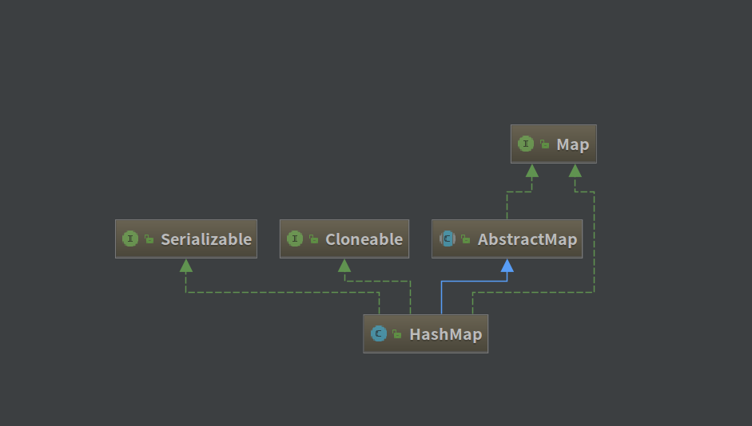
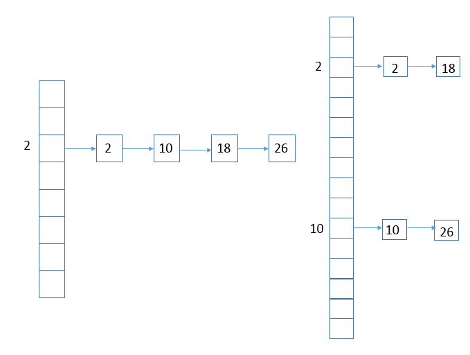

## HashMap 源码解析

[TOC]

### 一、类图

----------------------------------



关于 HashCode 的官方文档定义：

> hashcode方法返回该对象的哈希码值。支持该方法是为哈希表提供一些优点，例如，java.util.Hashtable 提供的哈希表。
> hashCode 的常规协定是：
> 在 Java 应用程序执行期间，在同一对象上多次调用 hashCode 方法时，必须一致地返回相同的整数，前提是对象上 equals 比较中所用的信息没有被修改。从某一应用程序的一次执行到同一应用程序的另一次执行，该整数无需保持一致。   
>
> 如果根据 equals(Object) 方法，两个对象是相等的，那么在两个对象中的每个对象上调用 hashCode 方法都必须生成相同的整数结果。   
>
> 以下情况不 是必需的：如果根据 equals(java.lang.Object) 方法，两个对象不相等，那么在两个对象中的任一对象上调用 hashCode 方法必定会生成不同的整数结果。但是，程序员应该知道，为不相等的对象生成不同整数结果可以提高哈希表的性能。   
>
> 实际上，由 Object 类定义的 hashCode 方法确实会针对不同的对象返回不同的整数。（这一般是通过将该对象的内部地址转换成一个整数来实现的，但是 JavaTM 编程语言不需要这种实现技巧。）   
>
> 当equals方法被重写时，通常有必要重写 hashCode 方法，以维护 hashCode 方法的常规协定，该协定声明相等对象必须具有相等的哈希码。

由官方文档可得：

* hashcode 是用来散列存储结构中确定对象的存储地址。
* 如果两个对象相同，就是调用 equals 返回 true，那么这两个对象的 hashcode 一定相同。
* 如果对象的equals方法被重写，那么对象的hashCode也尽量重写。
* 如果两个对象的 hashcode 相同，并不一定表示两个对象相同，只能说明这两个对象在散列结构中**存放在同一个篮子里”**。


### 二、新旧 HashMap 的区别

---------------------------------

* JDK 1.8 以前 HashMap 的实现是 数组+链表，即使哈希函数取得再好，也很难达到元素百分百均匀分布。

* 当 HashMap 中有大量的元素都存放到同一个桶中时，这个桶下有一条长长的链表，这个时候 HashMap 就相当于一个单链表，假如单链表有 n 个元素，遍历的时间复杂度就是 O(n)，完全失去了它的优势。

* JDK 1.8 中引入了红黑树（查找时间复杂度为 O(logn)）来优化桶元素堆积问题。

* HashMap 的数据结构：**数组+链表+红黑树(JDK1.8新增)**、

  

  ​


### 三、HashMap 定义

----------------------

```java
public class HashMap<K,V> extends AbstractMap<K,V>
    implements Map<K,V>, Map, Serializable {}
```

* HashMap 是一个散列表，它存储内容是键值对( key-value )映射。
* HashMap 继承了 AbstractMap，实现了 Map、Map、Serializable 接口。
* HashMap 的实现不是同步的，其 key、value 都可以为 null。
* HashMap 中的映射不是有序的。


### 四、HashMap 属性

-----------------------

```java
	// 默认初始容量为16
	static final int DEFAULT_INITIAL_CAPACITY = 1 << 4; 
	// 最大容量为2的30次方
	static final int MAXIMUM_CAPACITY = 1 << 30;
`	// 默认加载因子为0.75f
    static final float DEFAULT_LOAD_FACTOR = 0.75f;
	// 桶转化为树的计数阀值
	// 就是当桶中元素个数超过这个值时，就需要使用红黑树节点替换链表节点
    static final int TREEIFY_THRESHOLD = 8;	
	// 树的链表还原阀值
	// 当扩容时，桶中元素小于这个值，就会把树形桶元素还原为链表结构
    static final int UNTREEIFY_THRESHOLD = 6;
	// 哈希表的最小树形化容量
	// 当哈希表中的容量大于这个值时，表中的桶才能进行树形化，否则桶内元素太多时会扩容，而不是树形化
	// 为了避免进行扩容、树形化选择的冲突，这个值不能小于 4 * TREEIFY_THRESHOLD
    static final int MIN_TREEIFY_CAPACITY = 64;
```

节点数据结构：

```java
	// 链表节点
    static class Node<K,V> implements Map.Entry<K,V> {
        final int hash;
        final K key;
        V value;
        Node<K,V> next;
      	// 省略构造方法和其他类方法
    }

	// JDK 1.8 新增红黑树
    static final class TreeNode<K,V> extends LinkedHashMap.Entry<K,V> {
        TreeNode<K,V> parent;  // red-black tree links
        TreeNode<K,V> left;
        TreeNode<K,V> right;
        TreeNode<K,V> prev;    // needed to unlink next upon deletion
        boolean red;
      	/**
      	 * 省略构造方法和其他类方法
      	 */
    }
```


### 五、HashMap 的构造方法

----------------------------------

```java
    // 构造一个指定初始容量和加载因子的HashMap
	public HashMap(int initialCapacity, float loadFactor) {
        if (initialCapacity < 0)
            throw new IllegalArgumentException("Illegal initial capacity: " +
                                               initialCapacity);
        if (initialCapacity > MAXIMUM_CAPACITY)
            initialCapacity = MAXIMUM_CAPACITY;
        if (loadFactor <= 0 || Float.isNaN(loadFactor))
            throw new IllegalArgumentException("Illegal load factor: " +
                                               loadFactor);
        this.loadFactor = loadFactor;
        this.threshold = tableSizeFor(initialCapacity);
    }
	// 构造一个指定初始容量的HashMap
    public HashMap(int initialCapacity) {
        this(initialCapacity, DEFAULT_LOAD_FACTOR);
    }
	// 构造一个使用默认初始容量(16)和默认加载因子(0.75)的HashMap
    public HashMap() {
        this.loadFactor = DEFAULT_LOAD_FACTOR; // all other fields defaulted
    }
	// 造一个指定map的HashMap，所创建HashMap使用默认加载因子(0.75)和足以容纳指定map的初始容量。
    public HashMap(Map<? extends K, ? extends V> m) {
        this.loadFactor = DEFAULT_LOAD_FACTOR;
        putMapEntries(m, false);
    }
    final void putMapEntries(Map<? extends K, ? extends V> m, boolean evict) {
        int s = m.size();
        if (s > 0) {
            if (table == null) { // pre-size
                float ft = ((float)s / loadFactor) + 1.0F;
                int t = ((ft < (float)MAXIMUM_CAPACITY) ?
                         (int)ft : MAXIMUM_CAPACITY);
                if (t > threshold)
                    threshold = tableSizeFor(t);
            }
            else if (s > threshold)
                resize();
            for (Map.Entry<? extends K, ? extends V> e : m.entrySet()) {
                K key = e.getKey();
                V value = e.getValue();
                putVal(hash(key), key, value, false, evict);
            }
        }
    }
```

HashMap 提供了四个构造方法：

* HashMap()：构造一个具有默认初始容量 (16) 和默认加载因子 (0.75) 的空 HashMap。
* HashMap(int initialCapacity)：构造一个带指定初始容量和默认加载因子 (0.75) 的空 HashMap。
* HashMap(int initialCapacity, float loadFactor)：构造一个带指定初始容量和加载因子的空 HashMap。
* public HashMap(Map<? extends K, ? extends V> m)：包含“子Map”的构造函数。


什么是加载因子？

> 加载因子是哈希表在其容量自动增加之前可以达到多满的一种尺度，它衡量的是一个散列表的空间的使用程度，负载因子越大表示散列表的装填程度越高，反之愈小。对于使用链表法的散列表来说，查找一个元素的平均时间是O(1+a)，因此如果负载因子越大，对空间的利用更充分，然而后果是查找效率的降低；如果负载因子太小，那么散列表的数据将过于稀疏，对空间造成严重浪费。系统默认负载因子为0.75，一般情况下我们是无需修改的。


### 六、Java API 方法摘要

------

- [Java JDK1.7 在线 API 文档](http://tool.oschina.net/apidocs/apidoc?api=jdk_7u4)


### 七、HashMap 重要方法解析

#### 1、桶的树形化 treeifyBin 方法

在 Java 8 中，如果一个桶中的元素个数超过 TREEIFY_THRESHOLD(默认是 8 )，就使用红黑树来替换链表，从而提高速度。这个方法叫树形化。

```java
	// 将桶内所有的链表节点替换成红黑树节点
	final void treeifyBin(Node<K,V>[] tab, int hash) {
        int n, index; Node<K,V> e;
      	// 如果当前哈希表为空，或者哈希表中元素的个数小于树形化的阈值(默认为64)，就去新建
        if (tab == null || (n = tab.length) < MIN_TREEIFY_CAPACITY)
            resize();
        else if ((e = tab[index = (n - 1) & hash]) != null) {
          	// 如果哈希表的个数超过了树形化的阈值
          	// e 代表着哈希表中指定位置桶里的第一个链表节点
            TreeNode<K,V> hd = null, tl = null;
            do {
              	// 新建同一个树行节点
                TreeNode<K,V> p = replacementTreeNode(e, null);
                if (tl == null)	// 确定树头节点
                    hd = p;
                else {
                    p.prev = tl;	// 完成依赖关系
                    tl.next = p;	// TreeNode 继承了 HashMap.Entry,Entry继承了HashMap.Node
                }
                tl = p;
            } while ((e = e.next) != null);
          	// 让桶的第一个元素指向新建的红黑树头结点，以后这个桶里的元素就是红黑树而不是链表了
            if ((tab[index] = hd) != null)
                hd.treeify(tab);
        }
    }
		// 将链表结构的树形节点转化为树结构
        final void treeify(Node<K,V>[] tab) {
            TreeNode<K,V> root = null;
            for (TreeNode<K,V> x = this, next; x != null; x = next) {	// 遍历
                next = (TreeNode<K,V>)x.next;	// 指针移动
                x.left = x.right = null;	
                if (root == null) {	// 如果是第一个节点
                    x.parent = null;
                    x.red = false;
                    root = x;
                }
                else {
                    K k = x.key;
                    int h = x.hash;
                    Class<?> kc = null;
                    for (TreeNode<K,V> p = root;;) {
                        int dir, ph;
                        K pk = p.key;
                        if ((ph = p.hash) > h)	// 大于，将节点放入插入点右侧
                            dir = -1;
                        else if (ph < h)	// 小于，将节点放入插入点左侧
                            dir = 1;
                        else if ((kc == null &&		// 相同，进行策略检查
                                  (kc = comparableClassFor(k)) == null) ||
                                 (dir = compareComparables(kc, k, pk)) == 0)
                            dir = tieBreakOrder(k, pk);

                        TreeNode<K,V> xp = p;
                        if ((p = (dir <= 0) ? p.left : p.right) == null) {
                            x.parent = xp;
                            if (dir <= 0)
                                xp.left = x;
                            else
                                xp.right = x;
                            root = balanceInsertion(root, x);	//平衡插入
                            break;
                        }
                    }
                }
            }
          	// 确保 root 是桶第一个节点，平衡后root可能不是原本的第一个节点
            moveRootToFront(tab, root); 
        }
```


#### 2、put 方法

put 方法的流程：

1. 判断键值对数组table[i]是否为空或为null，否则执行resize()进行扩容；
2. 根据键值key计算hash值得到插入的数组索引i，如果table[i]==null，直接新建节点添加，转向 6 ，如果table[i]不为空，转向 3 ；
3. 判断table[i]的首个元素是否和key一样，如果相同直接覆盖value，否则转向 4 ，这里的相同指的是hashCode以及equals；
4. 判断table[i] 是否为treeNode，即table[i] 是否是红黑树，如果是红黑树，则直接在树中插入键值对，否则转向 5 ；
5. 遍历table[i]，判断链表长度是否大于8，大于8的话把链表转换为红黑树，在红黑树中执行插入操作，否则进行链表的插入操作；遍历过程中若发现key已经存在直接覆盖value即可；
6. 插入成功后，判断实际存在的键值对数量size是否超多了最大容量threshold，如果超过，进行扩容。

```java
	// 将键值对压入 Map
	public V put(K key, V value) {
        return putVal(hash(key), key, value, false, true);
    }

	// 获得对象的 hashcode 值
    static final int hash(Object key) {
        int h;
        return (key == null) ? 0 : (h = key.hashCode()) ^ (h >>> 16);
    }

	final V putVal(int hash, K key, V value, boolean onlyIfAbsent,
                   boolean evict) {
        Node<K,V>[] tab; Node<K,V> p; int n, i;
        if ((tab = table) == null || (n = tab.length) == 0)	// 1
            n = (tab = resize()).length;
        if ((p = tab[i = (n - 1) & hash]) == null)			// 2
            tab[i] = newNode(hash, key, value, null);
        else {
            Node<K,V> e; K k;
            if (p.hash == hash &&							// 3
                ((k = p.key) == key || (key != null && key.equals(k))))
                e = p;
            else if (p instanceof TreeNode)					// 4
                e = ((TreeNode<K,V>)p).putTreeVal(this, tab, hash, key, value);
            else {											// 5
                for (int binCount = 0; ; ++binCount) {
                    if ((e = p.next) == null) {
                        p.next = newNode(hash, key, value, null);
                      	// 链表长度大于8转换为红黑树进行处理
                        if (binCount >= TREEIFY_THRESHOLD - 1) // -1 for 1st
                            treeifyBin(tab, hash);
                        break;
                    }
                    if (e.hash == hash &&
                        ((k = e.key) == key || (key != null && key.equals(k))))
                        break;
                    p = e;
                }
            }
            if (e != null) { // existing mapping for key
                V oldValue = e.value;
                if (!onlyIfAbsent || oldValue == null)
                    e.value = value;
                afterNodeAccess(e);
                return oldValue;
            }
        }
        ++modCount;
        if (++size > threshold)		// 6
            resize();
        afterNodeInsertion(evict);
        return null;
    }
```

关于 hash() 函数的分析：

**公式：**`(key == null) ? 0 : (h = key.hashCode()) ^ (h >>> 16);`

如果Key值为null，返回0；如果Key值不为空，返回原hash值和原hash值无符号右移16位的值按位异或的结果。按位异或就是把两个数按二进制，相同就取0，不同就取1。[ hashCode() 是 Object 的native 方法]

如：`0101^1110`的结果为`1011`。

把一个数右移16位即丢弃低16位，就是任何小于2^16的数右移16位后结果为0（2^16次方再右移刚好就是1）。


#### 3、get 方法

get的过程是先计算hash然后通过hash与table.length取摸计算index值，然后遍历table[index]上的链表/树，直到找到key，然后返回。

```java
	// 查找一个键
    public V get(Object key) {
        Node<K,V> e;
        return (e = getNode(hash(key), key)) == null ? null : e.value;
    }
	
    final Node<K,V> getNode(int hash, Object key) {
        Node<K,V>[] tab; Node<K,V> first, e; int n; K k;
      	// 根据哈希表元素个数与哈希值求模（使用的公式是 (n-1)&hash）得到 key 所在的桶的头结点
        if ((tab = table) != null && (n = tab.length) > 0 &&
            (first = tab[(n - 1) & hash]) != null) {
            if (first.hash == hash && // always check first node
                ((k = first.key) == key || (key != null && key.equals(k))))
                return first;
            if ((e = first.next) != null) {
                if (first instanceof TreeNode)	// 头节点是红黑树节点
                    return ((TreeNode<K,V>)first).getTreeNode(hash, key);
                do {		// 如果是链表结构，就遍历查找节点
                    if (e.hash == hash &&
                        ((k = e.key) == key || (key != null && key.equals(k))))
                        return e;
                } while ((e = e.next) != null);
            }
        }
        return null;
    }
	// 红黑树查找节点
	// 因为插入时已经保证有序了，所以采用了折半查找，效率很高。
	final TreeNode<K,V> getTreeNode(int h, Object k) {
		return ((parent != null) ? root() : this).find(h, k, null);
	}
```


#### 4、remove方法

remove方法和put、get类似，计算hash，计算index，然后遍历查找，将找到的元素从table[index]链表/树移除。

```java
    public V remove(Object key) {
        Node<K,V> e;
        return (e = removeNode(hash(key), key, null, false, true)) == null ?
            null : e.value;
    }

    final Node<K,V> removeNode(int hash, Object key, Object value,
                               boolean matchValue, boolean movable) {
        Node<K,V>[] tab; Node<K,V> p; int n, index;
        if ((tab = table) != null && (n = tab.length) > 0 &&
            (p = tab[index = (n - 1) & hash]) != null) {
            Node<K,V> node = null, e; K k; V v;
          	/**
          	 * 参考查找方法，省略
          	 */
            if (node != null && (!matchValue || (v = node.value) == value ||
                                 (value != null && value.equals(v)))) {
                if (node instanceof TreeNode)	// 树结构直接移除
                    ((TreeNode<K,V>)node).removeTreeNode(this, tab, movable);
                else if (node == p)
                    tab[index] = node.next;	// 链表结构直接移除
               /**
                * 省略
                */
            }
        }
        return null;
    }
```


#### 5、clear 方法

clear 方法遍历整个 tab，将每个元素设置为 null，同时修改元素个数为 0.

```java
    public void clear() {
        Node<K,V>[] tab;
        modCount++;
        if ((tab = table) != null && size > 0) {
            size = 0;
            for (int i = 0; i < tab.length; ++i)
                tab[i] = null;
        }
    }
```


#### 6、resize 方法

```java
    final Node<K,V>[] resize() {
        Node<K,V>[] oldTab = table;			// 当前数组
        int oldCap = (oldTab == null) ? 0 : oldTab.length;	// 当前数组的容量
        int oldThr = threshold;		// 保存当前阀值
        int newCap, newThr = 0;
        if (oldCap > 0) {
          	// 如果当前数组已经是默认最大容量MAXIMUM_CAPACITY，则将临界值改为Integer.MAX_VALUE
            if (oldCap >= MAXIMUM_CAPACITY) {	
                threshold = Integer.MAX_VALUE;
                return oldTab;
            }
          	// 否则，阀值翻倍
            else if ((newCap = oldCap << 1) < MAXIMUM_CAPACITY &&
                     oldCap >= DEFAULT_INITIAL_CAPACITY)
                newThr = oldThr << 1; // double threshold
        }
      	// 之前的阀值大于 0
        else if (oldThr > 0) // initial capacity was placed in threshold
            newCap = oldThr;
        else {	// 容量为0并且阀值为0，使用缺省值
            newCap = DEFAULT_INITIAL_CAPACITY;
            newThr = (int)(DEFAULT_LOAD_FACTOR * DEFAULT_INITIAL_CAPACITY);
        }
        if (newThr == 0) {	// 检查新阀值，如果为0
            float ft = (float)newCap * loadFactor;
            newThr = (newCap < MAXIMUM_CAPACITY && ft < (float)MAXIMUM_CAPACITY ?
                      (int)ft : Integer.MAX_VALUE);
        }
        threshold = newThr;
        @SuppressWarnings({"rawtypes","unchecked"})
            Node<K,V>[] newTab = (Node<K,V>[])new Node[newCap];	// 初始化 table
        table = newTab;
        if (oldTab != null) {
            for (int j = 0; j < oldCap; ++j) {	// 进行元素复制，重新进行 hash
                Node<K,V> e;
                if ((e = oldTab[j]) != null) {
                    oldTab[j] = null;
                    if (e.next == null)
                        newTab[e.hash & (newCap - 1)] = e;
                    else if (e instanceof TreeNode)		// 树结构
                        ((TreeNode<K,V>)e).split(this, newTab, j, oldCap);
                    else { // preserve order			// 链表结构
                        Node<K,V> loHead = null, loTail = null;
                        Node<K,V> hiHead = null, hiTail = null;
                        Node<K,V> next;
                        do {
                            next = e.next;
                          	// 将同一桶中的元素根据(e.hash & oldCap)是否为0进行分割，分成两个不同的链表，完成rehash
                            if ((e.hash & oldCap) == 0) {
                                if (loTail == null)
                                    loHead = e;
                                else
                                    loTail.next = e;
                                loTail = e;
                            }
                            else {
                                if (hiTail == null)
                                    hiHead = e;
                                else
                                    hiTail.next = e;
                                hiTail = e;
                            }
                        } while ((e = next) != null);
                        if (loTail != null) {
                            loTail.next = null;
                            newTab[j] = loHead;
                        }
                        if (hiTail != null) {
                            hiTail.next = null;
                            newTab[j + oldCap] = hiHead;
                        }
                    }
                }
            }
        }
        return newTab;
    }
```

如图所示：例如对于下标为 2 的链表扩容。




#### 7、containsKey 和 containsValue 方法

```java
    // containsKey 方法，getNode 方法的实现前面已经提到过
	public boolean containsKey(Object key) {
        return getNode(hash(key), key) != null;
    }
```

这里需要强调的是：**HashMap将“key为null”的元素都放在table的位置0处**，即table[0]中；“key不为null”的放在table的其余位置！

```java
	// containsValue 方法，该方法直接遍历所有元素直到找到 value 为止
	public boolean containsValue(Object value) {
        Node<K,V>[] tab; V v;
        if ((tab = table) != null && size > 0) {
            for (int i = 0; i < tab.length; ++i) {
                for (Node<K,V> e = tab[i]; e != null; e = e.next) {
                    if ((v = e.value) == value ||
                        (value != null && value.equals(v)))
                        return true;
                }
            }
        }
        return false;
    }
```


