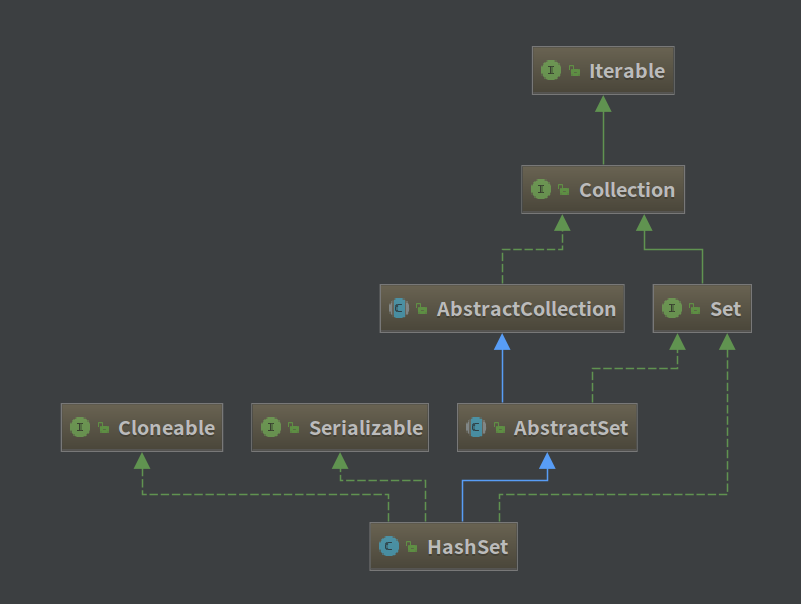

## HashSet 源码解析

[TOC]

### 一、类图

-------------------------



对于 HashSet 来说，它是基于 HashMap 来实现的，其底层采用了 HashMap 来保存元素。


### 二、HashSet 定义

---------------------------------------

```java
public class HashSet<E> extends AbstractSet<E>
    implements Set<E>, Cloneable, java.io.Serializable
```

HashSet 是一个**没有重复元素的集合**。

- 由 HashMap 实现，不保证元素的顺序，允许使用 null 元素。
- 非同步集合。
- 实现了 Set 、Cloneable、Serializable 等接口。


### 三、HashSet 属性

---------------------

```java
	// 底层使用 HashMap 来存储元素
	private transient HashMap<E,Object> map;
	// 由于 Set 只使用了 Map 的 key 值，所以定义一个 Object 来填充 value 值
    private static final Object PRESENT = new Object();
```

**为什么不适用 null 元素而采用 Object 来填充 Map 的 value？**

**答：**避免 **java.lang.NullPointerException** 的出现。虽然 Java 号称没有指针，但老是会碰到 NullPointerException。所以使用8个 byte 位的空间来从根源上避免这个问题。


### 四、HashSet 构造方法

----------------------------

```java
	// 使用默认容量大小16和默认加载因子0.75初始化map，构造一个HashSet 
    public HashSet() {
        map = new HashMap<>();
    }
	// 构造一个指定Collection参数的HashSet
    public HashSet(Collection<? extends E> c) {
        map = new HashMap<>(Math.max((int) (c.size()/.75f) + 1, 16));
        addAll(c);
    }
	// 使用指定的初始容量大小和加载因子初始化map，构造一个HashSet
    public HashSet(int initialCapacity, float loadFactor) {
        map = new HashMap<>(initialCapacity, loadFactor);
    }
	// 使用指定的初始容量大小和默认的加载因子0.75初始化map，构造一个HashSet
    public HashSet(int initialCapacity) {
        map = new HashMap<>(initialCapacity);
    }
	// 不对外公开的一个构造方法（默认default修饰）
	//  底层构造的是LinkedHashMap，dummy只是一个标示参数，无具体意义
    HashSet(int initialCapacity, float loadFactor, boolean dummy) {
        map = new LinkedHashMap<>(initialCapacity, loadFactor);
    }
```

**注意：**前三个构造方法比较好理解。最后一个方法构造的是 LinkedHashMap，该方法是提供给 LinkedHashSet 并不对外公开。


### 五、HashSet 重要方法解析

----------------------------------

#### 1、诸多方法

HashSet 许多方法都是直接调用 HashMap 对应的方法来实现的，所以只需理解清楚 HashMap 的主要方法以此类推即可。

* [HashMap 源码解析](https://github.com/FunriLy/AlgorithmDemo/blob/master/docs/HashMap%20%E6%BA%90%E7%A0%81%E8%A7%A3%E6%9E%90.md)


### 六、HashSet 与 HashMap 的区别

| HashMap             | HashSet            |
| ------------------- | ------------------ |
| 实现了 Map 接口          | 实现了 Set 接口         |
| 用于存储键值对             | 仅仅用于存储对象           |
| 使用键值对来计算 hashCode 值 | 利用成员对象来计算hashCode值 |
| 速度比较快，因为是通过唯一的键来获得值 | 较 HashMap 来说比较慢    |

