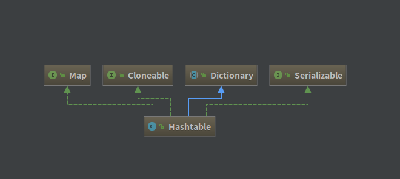

## Hashtable 源码解析

[TOC]

### 一、类图

---------------------------------------



看完 Hashtable 源码后，我认为它还是比较简单的，由数组+链表实现，没有像 HashMap 一样重新构造红黑树，不过基本上所有 `public` 方法都用了**synchronized**来修饰，确保了线程安全。


### 二、Hashtable 定义

-------------------------------

```java
public class Hashtable<K,V> extends Dictionary<K,V>
    implements Map<K,V>, Cloneable, java.io.Serializable {}
```

- Hashtable 是一个散列表，它存储内容是键值对(key-value)映射。
- Hashtable 要求 key 和 value 不能为 null。
- 为了成功地在哈希表中存储和获取对象，用作键的对象必须实现 hashCode 方法和 equals 方法。
- Hashtable大部分类用**synchronized**修饰，证明Hashtable是线程安全的。


### 三、Hashtable 属性

-----------------

```java
	// 键值对/Entry数组，每个Entry本质上是一个单向链表的表头
	private transient Entry<?,?>[] table;
	// 元素个数
    private transient int count;
	// rehash 阀值
    private int threshold;
	// 装填因子
    private float loadFactor;
	// 键值对集合
    private transient volatile Set<K> keySet;
	// key 集合，且 key 不能重复
    private transient volatile Set<Map.Entry<K,V>> entrySet;
	// value 集合，可重复
    private transient volatile Collection<V> values;
	// fail-fast 机制
    private transient int modCount = 0;
	// 节点
    private static class Entry<K,V> implements Map.Entry<K,V> {
        final int hash;
        final K key;
        V value;
        Entry<K,V> next;
      	// ………………
    }
```

由此可见，Hashtable 还是采用 数组+链表 来实现的。


### 四、Hashtable 构造方法

----------------------------------------------

```java
	// 指定初始容量和装载因子
	public Hashtable(int initialCapacity, float loadFactor) {
        if (initialCapacity < 0)
            throw new IllegalArgumentException("Illegal Capacity: "+ initialCapacity);
        if (loadFactor <= 0 || Float.isNaN(loadFactor))
            throw new IllegalArgumentException("Illegal Load: "+loadFactor);
        if (initialCapacity==0)
            initialCapacity = 1;
        this.loadFactor = loadFactor;
        table = new Entry<?,?>[initialCapacity];
        threshold = (int)Math.min(initialCapacity * loadFactor, MAX_ARRAY_SIZE + 1);
    }
	// 指定初始容量，默认装载因子为 0.75f
    public Hashtable(int initialCapacity) {
        this(initialCapacity, 0.75f);
    }
	// 默认初始容量为 11，装载因子为 0.75f
    public Hashtable() {
        this(11, 0.75f);
    }
	// 使用map进行构造，扩大容量为map元素个数的两倍(大于11)，默认装载因子为 0.75f
    public Hashtable(Map<? extends K, ? extends V> t) {
        this(Math.max(2*t.size(), 11), 0.75f);
        putAll(t);
    }
    public synchronized void putAll(Map<? extends K, ? extends V> t) {
        for (Map.Entry<? extends K, ? extends V> e : t.entrySet())
            put(e.getKey(), e.getValue());
    }
```


### 五、Hashtable 重要方法解析

-------------------------------

**Hashtable 中许多方法都加上了关键字 `synchronized`,以此来保证线程安全性。**

#### 1、put 方法

```java
  	// 添加元素
	// 原key键值存在，返回原key键对应的value；原key键值不存在，返回null
	public synchronized V put(K key, V value) {
        if (value == null) {	// 确保value不能为null
            throw new NullPointerException();
        }
        Entry<?,?> tab[] = table;
        int hash = key.hashCode();	// 获得 havaCode 值
      	// 计算键值对的桶位（本质是键值对在tab数组中的索引）
      	// Hashtable本质上采用除数取余法进行散列分布，模运算效率较低
        int index = (hash & 0x7FFFFFFF) % tab.length;
        @SuppressWarnings("unchecked")
        Entry<K,V> entry = (Entry<K,V>)tab[index];
        for(; entry != null ; entry = entry.next) { // 遍历查找
            if ((entry.hash == hash) && entry.key.equals(key)) {
                V old = entry.value;
                entry.value = value;
                return old;	// 找到 key 值并返回
            }
        }
        addEntry(hash, key, value, index);	// 添加元素
        return null;
    }
    private void addEntry(int hash, K key, V value, int index) {
        modCount++;
        Entry<?,?> tab[] = table;
        if (count >= threshold) {	// 检查是否需要扩容
            rehash();
            tab = table;
            hash = key.hashCode();
            index = (hash & 0x7FFFFFFF) % tab.length;
        }
        @SuppressWarnings("unchecked")
        Entry<K,V> e = (Entry<K,V>) tab[index];
        tab[index] = new Entry<>(hash, key, value, e);
        count++;
    }
```

1. 如果Hashtable含有key，设置(key, oldValue) -> (key, newValue)；
2. 如果Hashtable不含有key, 调用`addEntry(...)`添加新的键值对；


#### 2、remove方法

```java
	// 根据key值删除并返回要删除的value
	public synchronized V remove(Object key) {
        Entry<?,?> tab[] = table;
        int hash = key.hashCode();
        int index = (hash & 0x7FFFFFFF) % tab.length;
        @SuppressWarnings("unchecked")
        Entry<K,V> e = (Entry<K,V>)tab[index];
        for(Entry<K,V> prev = null ; e != null ; prev = e, e = e.next) {	// 遍历找到节点
            if ((e.hash == hash) && e.key.equals(key)) {
                modCount++;
                if (prev != null) {		// 如果节点是桶的第一个元素
                    prev.next = e.next;
                } else {
                    tab[index] = e.next;
                }
                count--;
                V oldValue = e.value;
                e.value = null;
                return oldValue;
            }
        }
        return null;
    }
```


#### 3、扩容方法

```java
	// 扩容 （2*oldCap  + 1）
	@SuppressWarnings("unchecked")
    protected void rehash() {
        int oldCapacity = table.length;
        Entry<?,?>[] oldMap = table;
        int newCapacity = (oldCapacity << 1) + 1;	// 计算新容量
        if (newCapacity - MAX_ARRAY_SIZE > 0) {		// 检查容量最大值(Integer.MAX_VALUE - 8)
            if (oldCapacity == MAX_ARRAY_SIZE)
                return;
            newCapacity = MAX_ARRAY_SIZE;
        }
        Entry<?,?>[] newMap = new Entry<?,?>[newCapacity];	// 构造新的 Hashtable
        modCount++;
        threshold = (int)Math.min(newCapacity * loadFactor, MAX_ARRAY_SIZE + 1);
        table = newMap;
        for (int i = oldCapacity ; i-- > 0 ;) {		// 遍历并存入新的 Hashtable
            for (Entry<K,V> old = (Entry<K,V>)oldMap[i] ; old != null ; ) {
                Entry<K,V> e = old;
                old = old.next;
                int index = (e.hash & 0x7FFFFFFF) % newCapacity;
                e.next = (Entry<K,V>)newMap[index];
                newMap[index] = e;
            }
        }
    }
```


#### 4、clone方法

```java
   	// 克隆 Hashtable
	public synchronized Object clone() {
        try {
            Hashtable<?,?> t = (Hashtable<?,?>)super.clone();
            t.table = new Entry<?,?>[table.length];
            for (int i = table.length ; i-- > 0 ; ) {
                t.table[i] = (table[i] != null)
                    ? (Entry<?,?>) table[i].clone() : null;
            }
            t.keySet = null;
            t.entrySet = null;
            t.values = null;
            t.modCount = 0;
            return t;
        } catch (CloneNotSupportedException e) {
            throw new InternalError(e);
        }
    }
```


#### 5、获得视图方法

```java
	// 获得 map 的 key 视图，通过Set视图可获得迭代器Iterator对象，对map进行迭代
    public Set<Map.Entry<K,V>> entrySet() {
        if (entrySet==null)
            entrySet = Collections.synchronizedSet(new EntrySet(), this);
        return entrySet;
    }
	// 常规方法，
    private class EntrySet extends AbstractSet<Map.Entry<K,V>> {
        public Iterator<Map.Entry<K,V>> iterator() {
            return getIterator(ENTRIES);
        }
        public boolean add(Map.Entry<K,V> o) {
            return super.add(o);
        }
        public boolean contains(Object o) {
            if (!(o instanceof Map.Entry))
                return false;
            Map.Entry<?,?> entry = (Map.Entry<?,?>)o;
            Object key = entry.getKey();
            Entry<?,?>[] tab = table;
            int hash = key.hashCode();
            int index = (hash & 0x7FFFFFFF) % tab.length;

            for (Entry<?,?> e = tab[index]; e != null; e = e.next)
                if (e.hash==hash && e.equals(entry))
                    return true;
            return false;
        }

        public boolean remove(Object o) {
            if (!(o instanceof Map.Entry))
                return false;
            Map.Entry<?,?> entry = (Map.Entry<?,?>) o;
            Object key = entry.getKey();
            Entry<?,?>[] tab = table;
            int hash = key.hashCode();
            int index = (hash & 0x7FFFFFFF) % tab.length;

            @SuppressWarnings("unchecked")
            Entry<K,V> e = (Entry<K,V>)tab[index];
            for(Entry<K,V> prev = null; e != null; prev = e, e = e.next) {
                if (e.hash==hash && e.equals(entry)) {
                    modCount++;
                    if (prev != null)
                        prev.next = e.next;
                    else
                        tab[index] = e.next;

                    count--;
                    e.value = null;
                    return true;
                }
            }
            return false;
        }

        public int size() {
            return count;
        }

        public void clear() {
            Hashtable.this.clear();
        }
    }
```


#### 6、比较方法

```java
    // ？Hashtable 比较方法
	public synchronized boolean equals(Object o) {
        if (o == this)
            return true;
        if (!(o instanceof Map))	// 不是 Map
            return false;
        Map<?,?> t = (Map<?,?>) o;
        if (t.size() != size())		// 数量不同
            return false;
        try {
            Iterator<Map.Entry<K,V>> i = entrySet().iterator();
            while (i.hasNext()) {	// 遍历比较
                Map.Entry<K,V> e = i.next();
                K key = e.getKey();
                V value = e.getValue();
                if (value == null) {
                    if (!(t.get(key)==null && t.containsKey(key)))
                        return false;
                } else {
                    if (!value.equals(t.get(key)))
                        return false;
                }
            }
        } catch (ClassCastException unused)   {
            return false;
        } catch (NullPointerException unused) {
            return false;
        }
        return true;
    }
```


