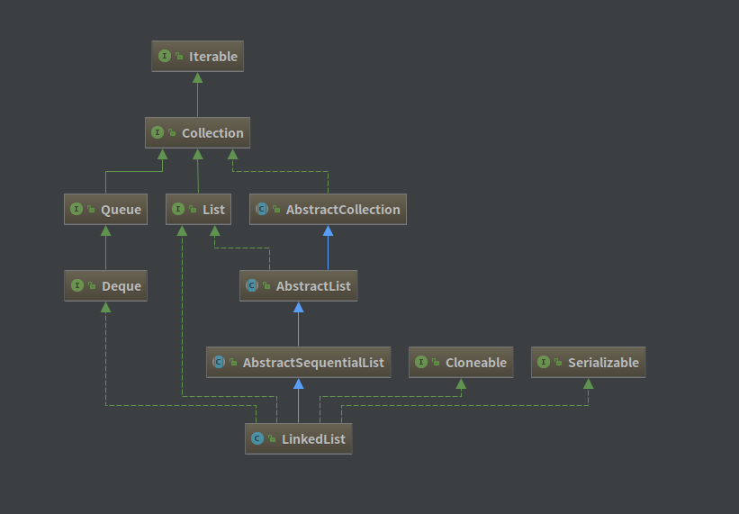
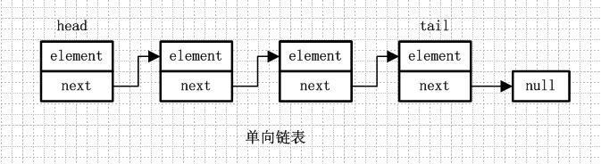
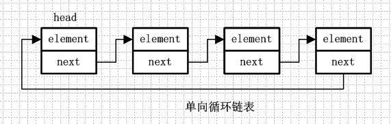
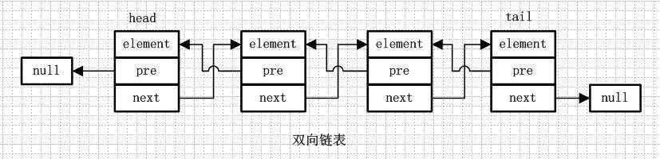
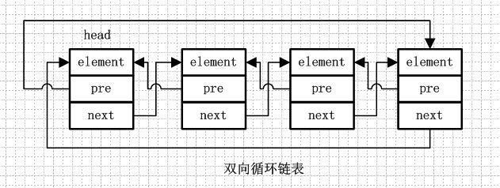
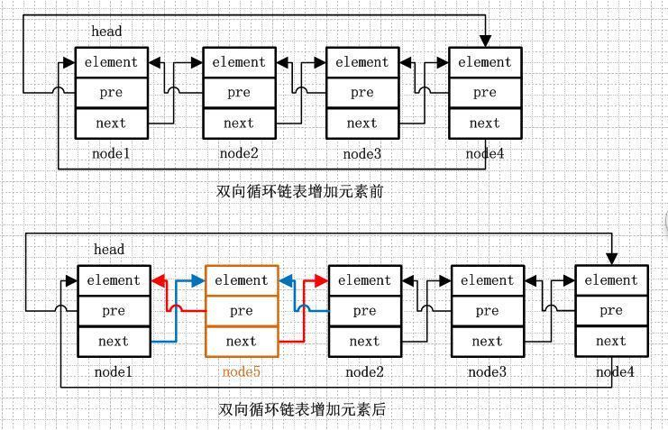

## LinkedList 源码解析

[TOC]

### 一、类图

----------------------------




**1.1.单向链表**
单向链表就是通过每个结点的指针指向下一个结点从而链接起来的结构，最后一个节点的next指向null。



**1.2.单向循环链表**
单向循环链表和单向列表的不同是，最后一个节点的next不是指向null，而是指向head节点，形成一个“环”。



**1.3.双向链表**
双向链表是包含两个指针的，pre指向前一个节点，next指向后一个节点，但是第一个节点head的pre指向null，最后一个节点的tail指向null。



**1.4.双向循环链表**
双向循环链表和双向链表的不同在于，第一个节点的pre指向最后一个节点，最后一个节点的next指向第一个节点，也形成一个“环”。**而LinkedList就是基于双向循环链表设计的。**



### 二、LinkedList 定义

----------------------

```java
public class LinkedList<E> extends AbstractSequentialList<E>
    implements List<E>, Deque<E>, Cloneable, java.io.Serializable{}
```

LinkedList 是一个双向循环链表，也可以被当作堆栈、队列或双端队列进行操作。

* LinkedList 实现了 List 接口，能对它进行队列操作。
* LinkedList 实现了 Deque 接口，能对它进行双端队列操作。
* LinkedList 实现了 Cloneable 接口，能够进行克隆。
* LinkedList 实现了 java.io.Serializable 接口，支持序列化传输。


### 三、LinkedList 属性

--------------------

```java
transient int size = 0;
transient Node<E> first;
transient Node<E> last;
```

Node 是链表的节点对象，是 LinkedList 的私有内部类：

```java
    private static class Node<E> {
        E item;	//当前元素
        Node<E> next;	//下一个元素节点
        Node<E> prev;	//上一个元素节点
        Node(Node<E> prev, E element, Node<E> next) {
            this.item = element;
            this.next = next;
            this.prev = prev;
        }
    }
```


### 四、LinkedList 构造方法

-----------------------------

```java
	// 空构造方法
	public LinkedList() {
    }
	// 构造一个包含指定 collection 中的元素的列表，这些元素按其 collection 的迭代器返回的顺序排列
    public LinkedList(Collection<? extends E> c) {
        this();
        addAll(c);
    }
```


### 五、Java API 方法摘要

------

- [Java JDK1.7 在线 API 文档](http://tool.oschina.net/apidocs/apidoc?api=jdk_7u4)

### 六、LinkedList 重要方法解析

------

#### 1、增加

```java
	// 将一个元素添加至尾部
	public void addFirst(E e) {
        linkFirst(e);
    }
    private void linkFirst(E e) {
        final Node<E> f = first;
        final Node<E> newNode = new Node<>(null, e, f);	//构造新节点并将节点加入到链表尾部
        first = newNode;
        if (f == null)
            last = newNode;
        else
            f.prev = newNode;
        size++;
        modCount++;
    }

	// 将一个元素添加至首部
	public void addLast(E e) {
        linkLast(e);
    }
    void linkLast(E e) {
        final Node<E> l = last;
        final Node<E> newNode = new Node<>(l, e, null);
        last = newNode;
        if (l == null)
            first = newNode;
        else
            l.next = newNode;
        size++;
        modCount++;
    }

	// 在指定位置添加元素
    public void add(int index, E element) {
        checkPositionIndex(index);

        if (index == size)
            linkLast(element);	// 添加至最后
        else
            linkBefore(element, node(index));
    }
    void linkBefore(E e, Node<E> succ) {
        // assert succ != null;
        final Node<E> pred = succ.prev;	// 拿到节点的前一个节点位置
        final Node<E> newNode = new Node<>(pred, e, succ);
        succ.prev = newNode;	// 构造双向循环关系
        if (pred == null)
            first = newNode;
        else
            pred.next = newNode;
        size++;
        modCount++;
    }
```

**双向循环链表的头结点是不保存数据的。**

```java
    // 往链表中添加一个集合
	public boolean addAll(Collection<? extends E> c) {
        return addAll(size, c);	// 将集合元素添加到list最后的尾部
    }
	
	// 在指定位置添加一个元素集合
    public boolean addAll(int index, Collection<? extends E> c) {
        checkPositionIndex(index);	// 越界检查
        Object[] a = c.toArray();	// 将集合转为数组
        int numNew = a.length;
        if (numNew == 0)
            return false;
        Node<E> pred, succ;	// 定义插入位置前后节点位置
        if (index == size) {
            succ = null;
            pred = last;
        } else {
            succ = node(index);
            pred = succ.prev;
        }
        for (Object o : a) {	// 依次取出元素构造元素链表
            @SuppressWarnings("unchecked") E e = (E) o;
            Node<E> newNode = new Node<>(pred, e, null);
            if (pred == null)
                first = newNode;
            else
                pred.next = newNode;
            pred = newNode;
        }
        if (succ == null) {	// 组合三段链表
            last = pred;
        } else {
            pred.next = succ;
            succ.prev = pred;
        }
        size += numNew;
        modCount++;
        return true;
    }

```



往链表中添加元素的核心逻辑(**改变前后指向关系**)：

1. 将元素转换为链表节点；
2. 增加该节点的前后引用；
3. 添加前后节点对于该节点的引用；


#### 2、删除

```java
    // 删除第一个匹配的指定元素
	public boolean remove(Object o) {
        if (o == null) {	// 依照 null 与非 null 的不同遍历节点
            for (Node<E> x = first; x != null; x = x.next) {
                if (x.item == null) {
                    unlink(x);	// 根据双向链表前后可移动的特点来移除元素
                    return true;
                }
            }
        } else {
            for (Node<E> x = first; x != null; x = x.next) {
                if (o.equals(x.item)) {
                    unlink(x);
                    return true;
                }
            }
        }
        return false;
    }
	// 从链表中移除指定元素
    E unlink(Node<E> x) {
        // assert x != null;
        final E element = x.item;	// 获得返回元素
        final Node<E> next = x.next;	// 获得下一个节点的引用
        final Node<E> prev = x.prev;	// 获得上一个节点的引用
        if (prev == null) {	// 根据引用属性调整联系
            first = next;
        } else {
            prev.next = next;
            x.prev = null;
        }
        if (next == null) {
            last = prev;
        } else {
            next.prev = prev;
            x.next = null;
        }
        x.item = null;	// 游离大对象，由回收机制自己回收
        size--;
        modCount++;
        return element;
    }
```


#### 3、更新

```java
    // 修改指定位置的元素
	public E set(int index, E element) {
        checkElementIndex(index);	// 越界检查
        Node<E> x = node(index);
        E oldVal = x.item;
        x.item = element;
        return oldVal;
    }

```

这里涉及到一个 node(index) 方法，这个方法非常常用：

```java
    Node<E> node(int index) {
      	// size>>1右移一位代表除以2，这里使用简单的二分方法，判断index与list的中间位置的距离
		if (index < (size >> 1)) {
            Node<E> x = first;
          	// 如果index距离list中间位置较近，则从头部向后遍历(next)
            for (int i = 0; i < index; i++)
                x = x.next;
            return x;
        } else {
            Node<E> x = last;
          	// 如果index距离list中间位置较远，则从头部向前遍历(previous)
            for (int i = size - 1; i > index; i--)
                x = x.prev;
            return x;
        }
    }
```

node(index) 方法实现起来比较简单，就是利用遍历元素找到对应的节点。为了优化查询效率，LinkedList采用了二分查找（这里说的二分只是简单的一次二分），判断index与size中间位置的距离，采取向后还是向前查找。


#### 4、查找

```java
    // 根据索引获取元素
	public E get(int index) {
        checkElementIndex(index);
        return node(index).item;
    }
	// 获取第一个元素
    public E getFirst() {
        final Node<E> f = first;
        if (f == null)
            throw new NoSuchElementException();
        return f.item;
    }
	// 获取最后一个元素
    public E getLast() {
        final Node<E> l = last;
        if (l == null)
            throw new NoSuchElementException();
        return l.item;
    }
```

通过上面的 node(index) 方法，我们可以得知**基于双向循环链表实现的LinkedList，通过索引Index的操作时低效的，index所对应的元素越靠近中间所费时间越长。而向链表两端插入和删除元素则是非常高效的（如果不是两端的话，都需要对链表进行遍历查找）。**


#### 5、是否包含

```java
    // 判断LinkedList是否包含元素(o)
	public boolean contains(Object o) {
        return indexOf(o) != -1;
    }
	// 从前向后查找，返回“值为对象(o)的节点对应的索引”
    public int indexOf(Object o) {
        int index = 0;
        if (o == null) {
            for (Node<E> x = first; x != null; x = x.next) {
                if (x.item == null)
                    return index;
                index++;
            }
        } else {
            for (Node<E> x = first; x != null; x = x.next) {
                if (o.equals(x.item))
                    return index;
                index++;
            }
        }
        return -1;
    }
	// 从后向前查找，返回“值为对象(o)的节点对应的索引”
    public int lastIndexOf(Object o) {
        int index = size;
        if (o == null) {
            for (Node<E> x = last; x != null; x = x.prev) {
                index--;
                if (x.item == null)
                    return index;
            }
        } else {
            for (Node<E> x = last; x != null; x = x.prev) {
                index--;
                if (o.equals(x.item))
                    return index;
            }
        }
        return -1;
    }
```


#### 6、其他(Deque 双端队列)

```java
 	// 调用 add 方法添加元素
	public boolean offer(E e) {
        return add(e);
    }
	// 检索并删除此列表的头（第一个元素）
    public E poll() {
        final Node<E> f = first;
        return (f == null) ? null : unlinkFirst(f);
    }
    private E unlinkFirst(Node<E> f) {
        final E element = f.item;
        final Node<E> next = f.next;
        f.item = null;
        f.next = null; // help GC
        first = next;
        if (next == null)
            last = null;
        else
            next.prev = null;
        size--;
        modCount++;
        return element;
    }
	// 检索但并不删除此列表的头（第一个元素）
    public E peek() {
        final Node<E> f = first;
        return (f == null) ? null : f.item;
    }
	// 添加一个元素
    public void push(E e) {
        addFirst(e);
    }
    public void addFirst(E e) {
        linkFirst(e);	// 上面提到过
    }
```


#### 7、总结

* LinkedList 是一个双向链表，其每一个节点包括的属性有：当前节点的值，上一个节点的引用，下一个节点的引用。
* LinkedList 不存在容量不足的情况。
* LinkedList 的序列化流的顺序和 ArrayList 差不多。


### 七、LinkedList 和 ArrayList 的区别

#### 1、区别总概

(1) ArrayList 实现了基于动态数组的数据结构，LinkedList 实现了基于链表的数据结构。

(2) 对于随机访问，ArrayList 的效率要优于 LinkedList，因为 LinkedList 需要移动指针。

(3) 对于增加、删除操作，LinkedList 比较占优势，因为 ArrayList 需要移动数据。


#### 2、迭代效率比较

**结论：ArrayList 使用 For 循环比较快；LinkedList 使用 Foreach 循环比较快。**

ArrayList 是实现了 RandomAccess (快速随机访问)接口而 LinkedList 则没有实现这个接口。

**实验代码：**

```java
public class MyLinkedLiet {
    private static int SIZE = 100000;
    public static void main(String[] args) {
        List<Integer> arrayList = new ArrayList<>();
        List<Integer> linkedList = new LinkedList<>();
        for(int i=0; i<SIZE; i++){
            arrayList.add(i);
            linkedList.add(i);
        }
        loopList(arrayList);
        loopList(linkedList);
    }

    private static void loopList(List<Integer> list) {
        int value = 0;
        long start = System.currentTimeMillis();
        for (int i=0; i<SIZE; i++) {
            value = list.get(i);
        }
        System.out.println(list.getClass().getSimpleName() + "使用普通for循环遍历时间为" +
                (System.currentTimeMillis() - start) + "ms");
        start = System.currentTimeMillis();
        for (Integer i : list) {
            value = i;
        }
        System.out.println(list.getClass().getSimpleName() + "使用foreach循环遍历时间为" +
                (System.currentTimeMillis() - start) + "ms");
    }
}
```


**实验结果：**

```json
	// 第一次实验
	ArrayList使用普通for循环遍历时间为25ms
	ArrayList使用foreach循环遍历时间为15ms
	LinkedList使用普通for循环遍历时间为7795ms
	LinkedList使用foreach循环遍历时间为15ms	
	// 第二次实验
	ArrayList使用普通for循环遍历时间为13ms
	ArrayList使用foreach循环遍历时间为11ms
	LinkedList使用普通for循环遍历时间为7723ms
	LinkedList使用foreach循环遍历时间为15ms
	// 第三次实验
	ArrayList使用普通for循环遍历时间为17ms
	ArrayList使用foreach循环遍历时间为10ms
	LinkedList使用普通for循环遍历时间为7831ms
	LinkedList使用foreach循环遍历时间为14ms
```

**注意：LinkedList 避免使用普通 for 循环，其遍历速度慢得令人发指。**


